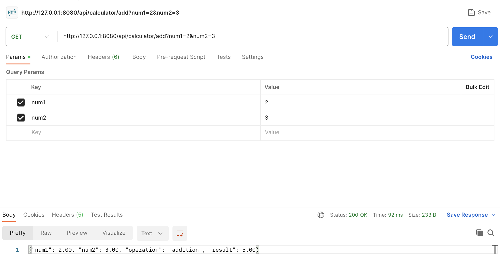

# Calculator application backend

This is a simple java springboot application which exposes calculator api.

## Prerequisites

- [Docker Installation](./DOCKER_BACKGROUND.md#docker-installation), If specific OS is not mentioned, please browse through [Official Docker](https://www.docker.com/get-started) documentation.


## Running the Application with Docker

1. Clone this repository:
    ```bash
   git clone https://github.com/SarathChandra24/MLOps-calculator-backend-spring.git
   ```
2. Navigate to the project directory:
   ```bash
   cd MLOps-calculator-backend-spring
   ```
3. Build the docker image:
   ```bash
   docker build -t  calculator-backend:latest .
   ```
4. Run the Docker container:
   ```bash
   docker run -p 8080:8080 calculator-backend:latest
   ```
   This will start the Spring Boot application inside a Docker container, and it will be accessible at http://localhost:8080.

5. To stop the Docker container, press Ctrl+C in the terminal where the container is running, or run:
    ```bash
    docker ps
    docker container stop <container-id>
    ```
    You can get the container-id from > docker ps


## Pushing the Image to container registry

### Docker Hub
1. Login to Docker Hub:

    Use the following command to log in to your Docker Hub account. Replace <username> with your Docker Hub username.

    ```bash
    docker login -u <username>
    ```
    You will be prompted to enter your Docker Hub password.

2. Tag the Docker Image:
    
    Before pushing the image, you need to tag it with your Docker Hub username and the repository name. Replace <username> with your Docker Hub username and <repository> with the name you want for your repository.

    ```bash
    docker tag your-docker-image-name:tag <username>/<repository>:tag
    ```

3. Push the Docker Image:
    Push the tagged image to Docker Hub:

    ```bash
    docker push <username>/<repository>:tag
    ```
This will push the Docker image to your Docker Hub repository. Now, your Docker image is available on Docker Hub under your specified repository.

Eg:
```bash
# Log in to Docker Hub
docker login -u sarathchandra24

# Tag the Docker image
docker tag calculator-backend:v1 sarathchandra24/calculator-backend:v1

# Push the Docker image
docker push sarathchandra24/calculator-backend:latest
```

## Test backend API

### Testing on Postman 


### Testing API on cURL
```bash
curl --location 'http://127.0.0.1:8080/api/calculator/add?num1=2&num2=3'
```

### Testing API using Python - Requests
```Python
import requests

url = "http://127.0.0.1:8080/api/calculator/add"

params = {'num1':2, 'num2':3}
headers = {}

response = requests.request("GET", url, headers=headers, params=payload)

print(response.text)
```
