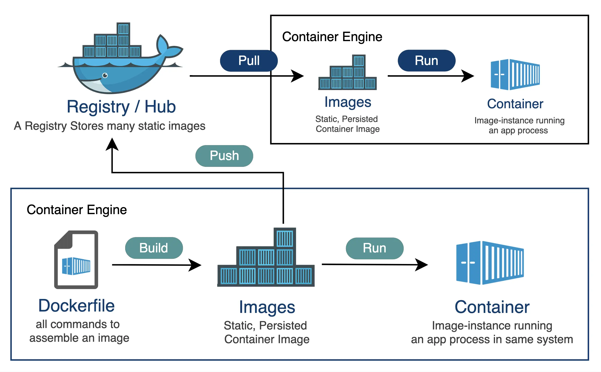
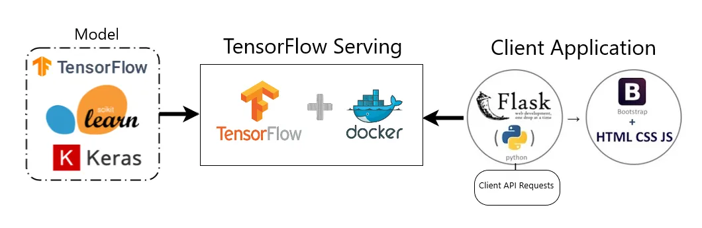

# Toturial Video
you can watch the toturial vidoe on my channel [Video](https://youtu.be/stdbAFjHAQY?si=vgOsFnBz_lMUF1X-)


# Docker

Docker is a platform for developing, shipping, and running applications in a consistent and isolated environment. It uses containerization technology to package applications and their dependencies into lightweight, portable containers. These containers can then be deployed and run consistently across different environments, such as development, testing, and production, without the need to worry about differences in the underlying infrastructure.

## Key Concepts


### Containers
- **Containers** are lightweight, standalone, and executable packages that include everything needed to run a piece of software, including the code, runtime, system tools, libraries, and settings. Containers are isolated from each other and the host system, ensuring consistent behavior.


### Images
- **Images** are read-only templates that define the file system and configuration of a container. You can create images from a Dockerfile, which is a script that specifies all the necessary instructions to build an image.

### Dockerfile
- A **Dockerfile** is a text file that contains instructions for building a Docker image. It includes commands for installing software, copying files, setting environment variables, and configuring the container.




### Registry
- A **Docker Registry** is a central repository for storing and sharing Docker images. Docker Hub is a popular public registry, but you can also set up private registries for your organization's images.

### Docker Compose
- **Docker Compose** is a tool for defining and running multi-container Docker applications. It allows you to define the services, networks, and volumes for your application in a single YAML file.

## Benefits of Docker

- **Portability:** Docker containers can run consistently across different environments, from a developer's laptop to a production server, reducing "it works on my machine" issues.

- **Isolation:** Containers provide process and file system isolation, ensuring that one container does not interfere with another. This makes it easy to manage dependencies and version conflicts.

- **Resource Efficiency:** Containers share the host operating system's kernel, which leads to lower overhead and faster startup times compared to traditional virtualization.

- **Scalability:** Docker makes it easy to scale applications by quickly launching additional containers. Tools like Docker Compose and container orchestration platforms like Kubernetes simplify container management.

- **Version Control:** Docker images are versioned, making it easy to track changes and roll back to previous versions if issues arise.

- **Security:** Containers provide a level of isolation, and Docker offers security features such as namespaces, control groups, and user namespaces to enhance security.




## Getting Started

To start using Docker, you'll need to:

1. **Install Docker:** Download and install Docker for your specific platform from [Docker's official website](https://www.docker.com/get-started).

2. **Run Your First Container:** Pull an existing image from Docker Hub and run it in a container using the `docker run` command.

3. **Create Docker Images:** Write a Dockerfile to define your application's image, build it, and run containers based on that image.

4. **Use Docker Compose:** Define multi-container applications and their dependencies in a `docker-compose.yml` file, then use `docker-compose` to manage the entire application stack.

Docker has become a fundamental tool for modern software development, enabling consistency, portability, and efficient application management in various environments.


# Containers vs. Images: Understanding the Difference

In the world of Docker, it's essential to grasp the distinction between containers and images. Let's illustrate this difference with a practical example:

## Containers

A **container** is a runnable instance of an image. Containers are lightweight, isolated environments that encapsulate an application and its dependencies. They run as independent processes on the host system, making it possible to run multiple instances of the same image concurrently.

### Example:

Imagine you have a simple web application that includes a web server. You use Docker to create a container, which becomes an instance of this web application. This container is isolated and can run independently.

## Images

An **image**, on the other hand, is a static, read-only blueprint for creating containers. It defines the file system, configuration, and application code needed for a specific environment. Images are used to create containers, and they can be versioned and shared.

### Example:

Continuing with our web application example, you create a Docker image (Image A) that includes the web server software, web application code, and necessary configurations. This image is a self-contained package that serves as the blueprint for creating containers.

## Practical Use:

1. **Creating Images:**
   - Docker images (e.g., Image A for the web server and Image B for the database) are constructed using Dockerfiles, specifying how to build them.

2. **Running Containers:**
   - Images (e.g., Image A) are used to launch containers (Container 1) that encapsulate the web application.
   - Containers (e.g., Container 2) run independently, even if they were created from the same image.

3. **Scaling and Version Control:**
   - You can scale your web application by creating more instances of Container 1 from Image A.
   - When updates are needed, changes are made to the corresponding Docker image (Image A or Image B), and new containers are created from the updated images. This ensures consistency and version control.

In summary, an image is a static blueprint that contains everything required to run an application, while a container is a running instance of an image. Containers provide isolation and portability, and they can be easily created and managed. This distinction is fundamental to Docker's effectiveness in software development and deployment.


# Docker Cheatsheet

## Basic Commands

### Images
- **List images**
  ```sh
  docker images
  ```

- **Pull an image from a repository**

```sh
docker pull <repository>:<tag>
```

- **Remove an image**
```sh
docker rmi <image_id>
```

## Containers
**
- **List running containers**
```sh
docker ps
```

- **List all containers (including stopped ones)**
```sh
docker ps -a
```

- **Run a container**
```sh
docker run -d -p <host_port>:<container_port> <repository>:<tag>
```

- **Stop a running container**
```sh
docker stop <container_id>
```

- **Remove a container**
```sh
docker rm <container_id>
```

### Volumes
- **List volumes**
```sh
  docker volume ls
```

- **Create a volume**
```sh
  docker volume create <volume_name>
```

- **Remove a volume**
```sh
  docker volume rm <volume_name>
```

### Networks
- **List networks**
```sh
  docker network ls
```

- **Create a network**
```sh
  docker network create <network_name>
```

- **Remove a network**
```sh
  docker network rm <network_name>
```

## Advanced Commands

### Building Images
- **Build an image from a Dockerfile**
```sh
  docker build -t <repository>:<tag> <path_to_dockerfile>
```

### Managing Containers
- **Start a stopped container**
```sh
  docker start <container_id>
```

- **Restart a container**
```sh
  docker restart <container_id>
```

- **Attach to a running container**
```sh
  docker attach <container_id>
```

- **View container logs**
```sh
  docker logs <container_id>
```

### Pruning
- **Remove unused data (images, containers, volumes, and networks)**
```sh
  docker system prune
```

## Deleting All Docker Images Locally

1. Stop all running containers:
```sh
   docker stop $(docker ps -q)
```

2. Remove all containers:
```sh
   docker rm $(docker ps -a -q)
```

3. Remove all images:
```sh
   docker rmi $(docker images -q)
```

### One-liner Command

To delete all Docker images, containers, and volumes with a single command:
```sh
docker stop $(docker ps -q) && docker rm $(docker ps -a -q) && docker rmi $(docker images -q)
```
### Additional Cleanup

To also remove all unused volumes and networks:
```sh
docker volume prune -f
docker network prune -f
```
