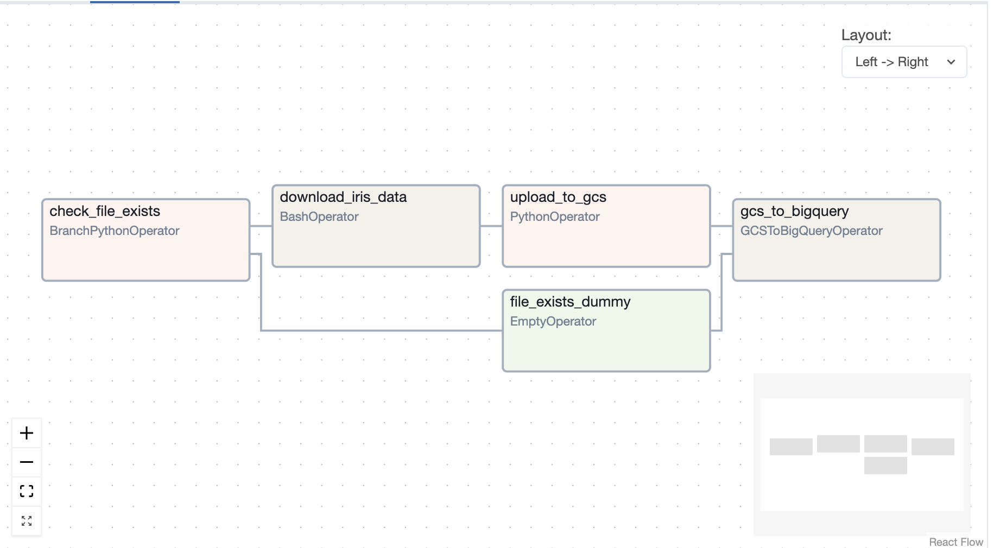
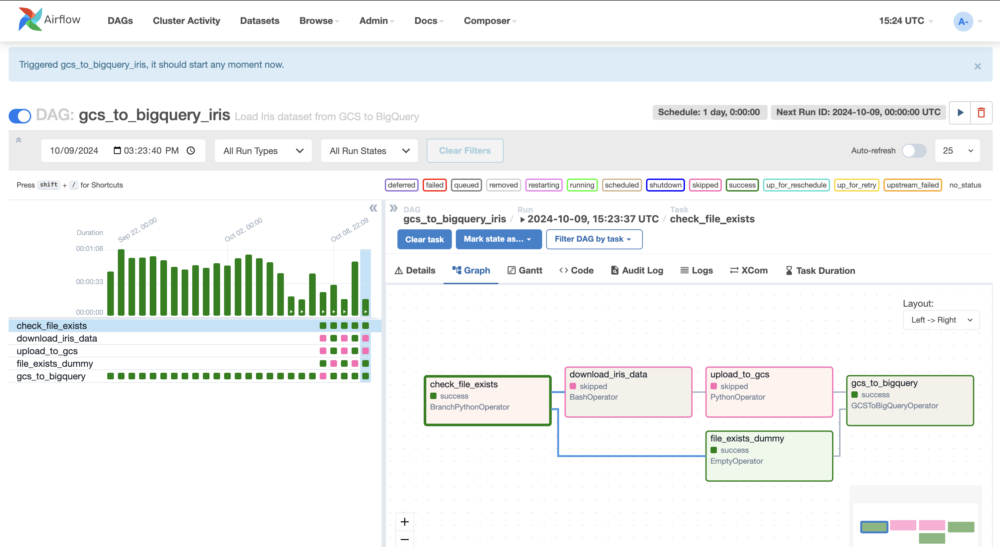

# GCS to BigQuery Iris Dataset Lab

Watch the tutorial for this lab on our channel [Video](https://youtu.be/VMnLPP_ohi0)

## Learning Objectives

In this lab, we will introduce several key concepts in cloud data engineering using Google Cloud Platform (GCP) and Apache Airflow. By completing this lab, you will learn:

1. How to set up and use Google Cloud Composer which is a managed Airflow service.
2. How to write conditional tasks and use branching feature in Airflow DAGs.
3. Learn to use hooks to interact with external APIs like Google Cloud Storage (GCS) and BigQuery.
4. How to write data from GCS to a table in BigQuery.
5. Understand the use of environmental variables in GCP Composer environments.
6. Learn about trigger rules in Airflow and how to use them when there is branching in your dag structure.

## Environmental Variables in GCP Composer

When using Google Cloud Composer, several environmental variables are available to your DAGs. Some of these variables which you can access them in your dag files are as following:

- `GCP_PROJECT`: The ID of the Google Cloud project where your Composer environment is running.
- `AIRFLOW_HOME`: The directory where Airflow is installed.
- `DAGS_FOLDER`: The directory where your DAG files are stored.

To use these variables in your DAG, you can import the `os` module and access them like this:

```python
import os

project_id = os.environ.get('GCP_PROJECT')
```

## Understanding the DAG File



Now, we talk about important parts of the `gcs_to_bigquery_iris.py` DAG file:

1. **Importing necessary modules**: We import various Airflow operators and hooks:
- `PythonOperator`: Used for running any python function.
- `BashOperator`: Used for running any bash command line as you would run it in the terminal.
- `DummyOperator`: Used as a placeholder for a task which does not a specific task but it is necessary for branching in some cases.
- `BranchPythonOperator`: Used the same way as other operators but it tells Airflow to treat the defined task as a branching node.
- `airflow.utils.trigger_rule`: Used to clarify how to branch based on the success or failure of the upstream tasks.


2. **Defining tasks**:
   - `check_file_exists`: A BranchPythonOperator that checks if the Iris dataset already exists in GCS.
   - `download_iris_data`: A BashOperator that downloads the Iris dataset if it doesn't exist in GCS.
   - `upload_to_gcs_task`: A PythonOperator that uploads the downloaded dataset to GCS.
   - `file_exists_dummy`: A DummyOperator that serves as a placeholder when the file already exists.
   - `load_to_bigquery`: A GCSToBigQueryOperator that loads the data from GCS to BigQuery.

4. **Using BranchPythonOperator**: This operator allows us to implement conditional logic in our DAG. The `check_file_exists` function returns the ID of the next task to execute based on whether the file exists in GCS or not.

```python
check_file_task = BranchPythonOperator(
    task_id='check_file_exists',
    python_callable=check_file_exists,
    dag=dag,
)
```


## Understanding TriggerRule

In this lab, we use the `TriggerRule.ONE_SUCCESS` for our `load_to_bigquery` task:

```python
load_to_bigquery = GCSToBigQueryOperator(
    ...
    trigger_rule=TriggerRule.ONE_SUCCESS,
    ...
)
```

This TriggerRule is crucial because of a potential pitfall when using BranchPythonOperator. By default, Airflow skips the execution of all tasks that are not on the selected branch. This could lead to the `load_to_bigquery` task being skipped if it's not properly configured.

By setting `trigger_rule=TriggerRule.ONE_SUCCESS`, we ensure that the `load_to_bigquery` task will run as long as at least one of its upstream tasks (either `upload_to_gcs_task` or `file_exists_dummy`) completes successfully. This prevents the task from being inadvertently skipped.


## Setting up task dependencies
We use the `>>` operator to define the order of task execution. Since there is branching in these sequence of tasks, we have written the tasks in three different lines. First line is dedicated to determine the starting task which is also the task after which branching happens. You declare branching in the task dependecies using `[task_a, task_b, task_c]` format. After this line, you declare what happends if the any of the tasks gets triggered.

```python
check_file_task >> [download_iris_data, file_exists_dummy]
download_iris_data >> upload_to_gcs_task >> load_to_bigquery
file_exists_dummy >> load_to_bigquery
```

Let's break this down:

- `check_file_task >> [download_iris_data, file_exists_dummy]`: This line sets up the branching. It means that after `check_file_task` executes, the DAG will proceed to either `download_iris_data` or `file_exists_dummy`, depending on the result of the `check_file_exists` function.

- `download_iris_data >> upload_to_gcs_task >> load_to_bigquery`: This defines the sequence of tasks if the file doesn't exist in GCS. It will download the data, then upload it to GCS, and finally load it to BigQuery.

- `file_exists_dummy >> load_to_bigquery`: This defines what happens if the file already exists in GCS. It skips the download and upload steps and goes straight to loading the data to BigQuery.

When setting up dependencies for a branching DAG, keep these points in mind:

1. The branching task (in this case, `check_file_task`) should point to all possible next tasks.
2. Each branch should be defined separately, showing the full sequence of tasks for that branch.
3. If branches converge later (as they do here with `load_to_bigquery`), make sure all branches lead to the convergence point.
4. Be mindful of the trigger rules for tasks after the branches converge. In this case, we use `TriggerRule.ONE_SUCCESS` for `load_to_bigquery` to ensure it runs regardless of which branch was executed.

By setting up the dependencies this way, we ensure that Airflow understands the full structure of our DAG and can execute the correct sequence of tasks based on the conditions we've defined.


## DAG Execution Paths


When the Iris dataset doesn't exist in GCS:
1. `check_file_exists` runs and returns 'download_iris_data'
2. `download_iris_data` executes to fetch the dataset
3. `upload_to_gcs_task` runs to upload the dataset to GCS
4. `load_to_bigquery` executes to load the data into BigQuery



When the Iris dataset already exists in GCS:
1. `check_file_exists` runs and returns 'file_exists_dummy'
2. `file_exists_dummy` executes (does nothing)
3. `load_to_bigquery` runs to load the existing data into BigQuery

These different paths demonstrate the power of conditional execution in Airflow DAGs.
