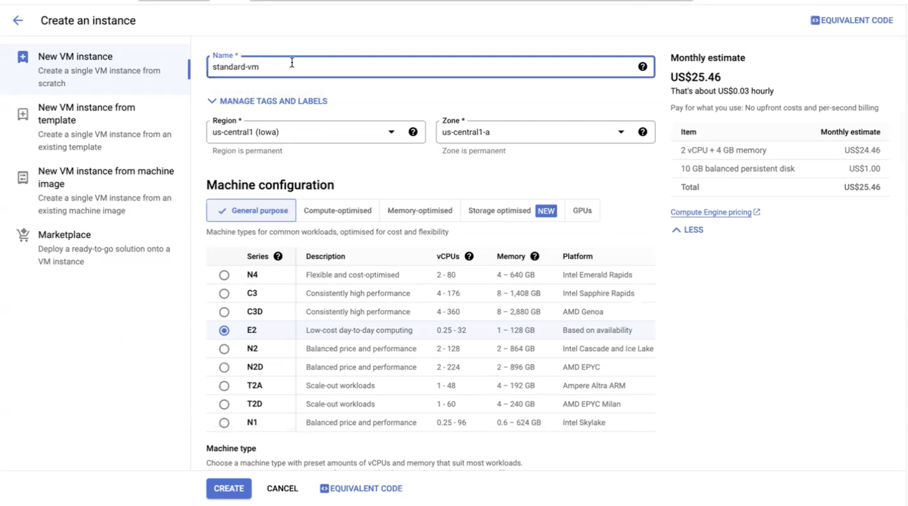
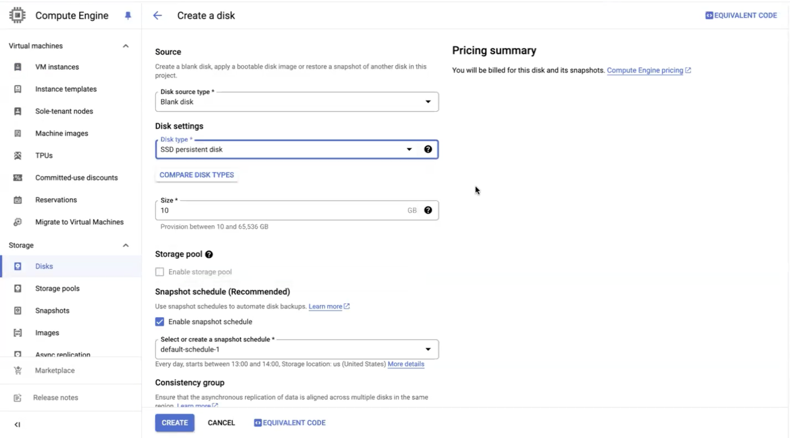
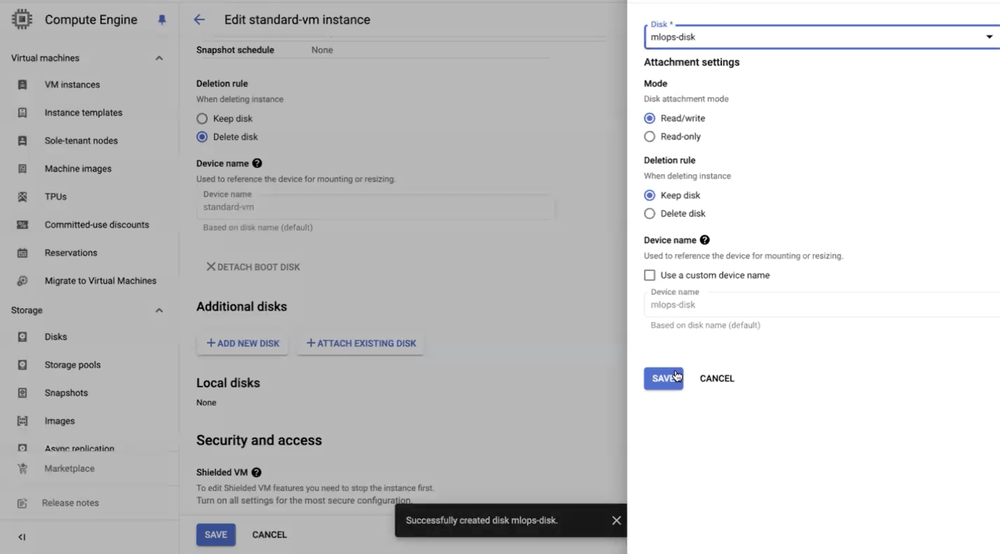
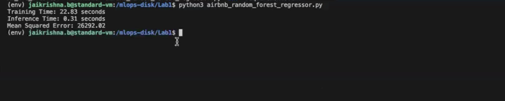
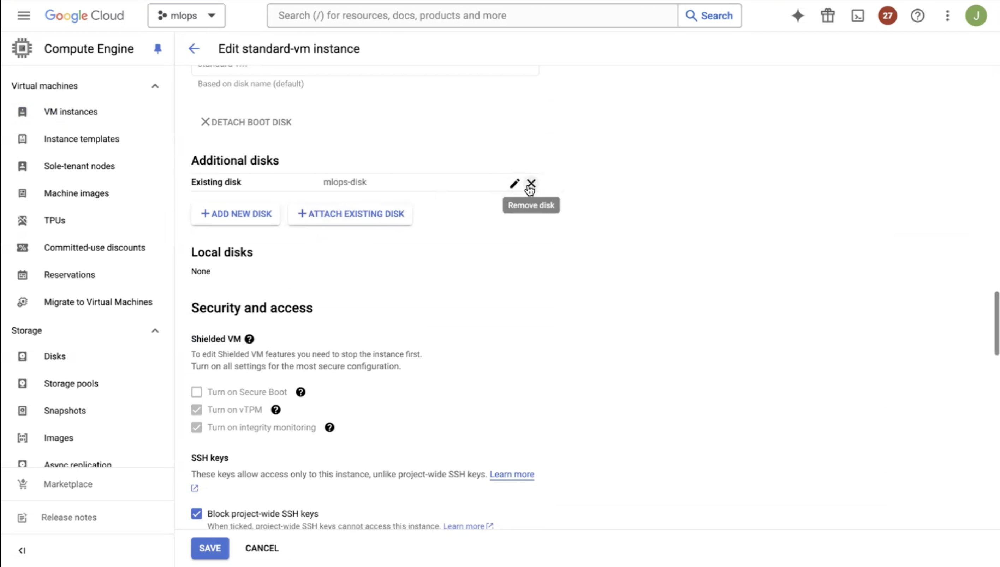
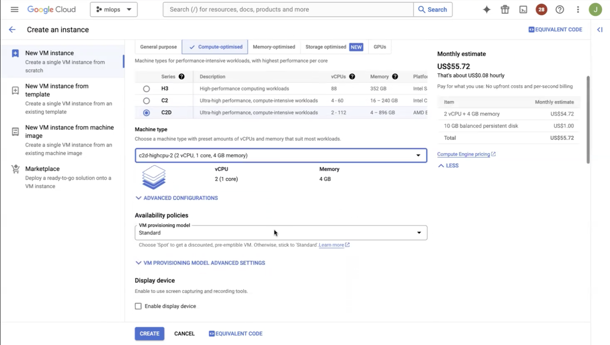
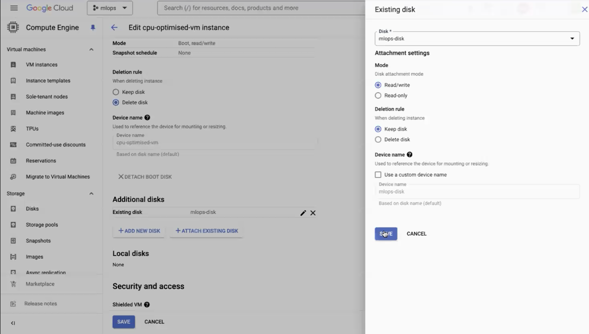
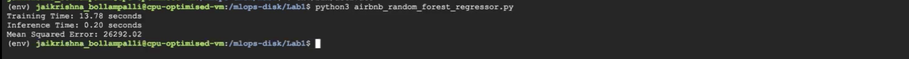

# **Google Cloud Platform Compute Engine**


## **Objective:**

This lab aims to teach participants the fundamentals of working with virtual machines (VMs) on Google Cloud Platform (GCP) Compute Engine. Through hands-on exercises, participants will learn how to create VM instances, choose appropriate machine types, launch VMs with various operating systems, manage instances, connect via SSH, monitor performance metrics, and work with persistent disks, including attaching, detaching, resizing, and taking snapshots.

[Google cloud compute engine](https://youtu.be/YPWv-Ln9IPw)

## **Lab Steps:**


### You can watch the tutorial video for this lab at 

   [Tutorial Video](https://www.youtube.com/watch?v=q3EU1Q4vp1g)


### **Step 1: Create a Standard VM :**


1. Go to the Google Cloud Console:[ https://console.cloud.google.com/](https://console.cloud.google.com/).
2. Navigate to Compute Engine > VM instances.
3. Click "Create Instance".
4. Set the machine type to "Custom" and choose 2 vCPUs and 4 GB memory.
5. Configure other settings as needed (e.g., region, zone, boot disk).

   

6. Click "Create" to create the VM instance.


### **Step 2: Create an SSD Persistent Disk (10GB) via Console:**


1. Go to the Google Cloud Console.
2. Navigate to Compute Engine > Disks.
3. Click "Create Disk".
4. Set the disk type to "SSD persistent disk" and size to 10GB.
   
   

5. Click "Create" to create the disk.


### **Step 3: Attach the Disk to the VM:**

1. Go to the Compute Engine > VM instances.
2. Click on the name of the VM instance you created.
3. Click "Edit".
4. Scroll down to the "Additional disks" section and click "Add existing disk".
5. Select the disk you created from the dropdown menu.

   

6. Click "Save".


### **Step 4: Add SSH Keys to the VM:**

Generate SSH keys if you haven't already: 


```bash
ssh-keygen -t rsa -b 2048 -C "your_email@example.com"
```


Add the public key to the VM instance:

1. Go to Compute Engine > VM instances.
2. Click on the instance name.
3. Click "Edit".
4. Scroll down to the "SSH keys" section and add your public key.
5. Click "Save".


### **Step 5: SSH into the Instance, Make Filesystem, and Mount the Disk:**


1. SSH into the instance using the SSH key you added in Step 4 , copy the username and instance_external_ip from compute engine console:

```bash
ssh -i path/to/private/key username@instance_external_ip
```


2. Once logged in, make the filesystem for the attached disk (/dev/sdb):

```bash
sudo mkfs.ext4 -F /dev/sdb
```


3. Create a directory to mount the disk:

```bash
sudo mkdir /mlops-disk
```


4. Mount the disk at /mlops-disk:

```bash
sudo mount /dev/sdb /mlops-disk
```

5. Add permission to the folder

```bash
sudo chown your-username-on-gcp /mlops-disk
```

### **Step 6: SCP the Folder with Airbnb Random Forest Regressor and Dataset to the Attached Disk:**

**Run from within your machine**

```bash
scp -r local/path/to/compute_engine_lab1 username@instance_external_ip:/mlops-disk
```


### **Step 7: SSH into the Instance:**


```bash
ssh -i path/to/private/key username@instance_external_ip
```


### **Step 8: Run the Code and Note Metrics:**

Install the requirements from requirements.txt file and run airbnb_random_forest_regressor.py


```bash
python3 /mlops-disk/compute_engine_lab1/airbnb_random_forest_regressor.py
```

** In case of permisssion error for installing pips, run **

```bash
sudo chown -R $USER:$USER /mlops-disk/Lab1/env
```


Note the training time, inference time, and mean squared error (MSE).




### **Step 9: Detach the Disk and Stop the Machine:**

1. Go to the Compute Engine > VM instances.
2. Click on the name of the VM instance you created.
3. Click "Edit".
4. Scroll down to the "Additional disks" section and click "Remove" next to the disk you want to detach.
   
   

5. Click "Save".
6. Go to the VM instances page, select the VM instance, and click "Stop" to stop the machine.


### **Step 10: Create a New Instance with CPU-Optimised Machine:**


1. Follow Steps 1 and 2 to create a new instance:
2. Go to the Google Cloud Console:[ https://console.cloud.google.com/](https://console.cloud.google.com/).
3. Navigate to Compute Engine > VM instances.
4. Click "Create Instance".
5. Choose a CPU-optimised machine type instead of the standard one.
6. Set the machine type to "Custom" and choose "c2d-highcpu-2" with 2 vCPUs and 4 GB memory.
   
   

7. Click "Create" to create the new VM instance.


### **Step 11: Attach the Disk to the New Instance:**

1. Go to the Compute Engine > VM instances.
2. Click on the name of the new VM instance you created.
3. Click "Edit".
4. Scroll down to the "Additional disks" section and click "Add existing disk".
5. Select the disk you previously used from the dropdown menu.

   

6. Click "Save".


### **Step 12: Run the Code on the New Instance and Note Metrics:**


1. Add SSH Keys to the New Instance
2. SSH into the new VM instance.
3. Once logged in, create a directory at /mlops-disk and mount the disk
4. Setup the requirements and run the Python code to execute the Airbnb random forest regressor and note the performance metrics.
5. Note the training time, inference time, and mean squared error (MSE).
   
   


### **Step 13: Stop the New Instance:**


1. Go to the Compute Engine > VM instances.
2. Select the new instance.
3. Click "Stop" to stop the machine.