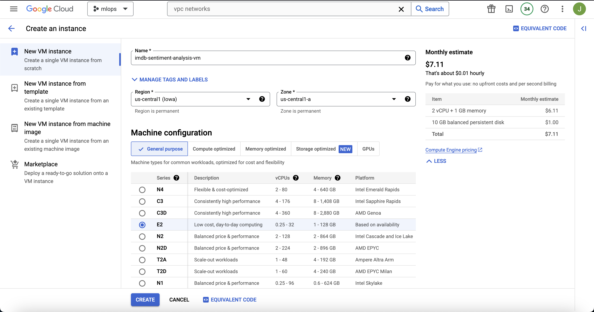
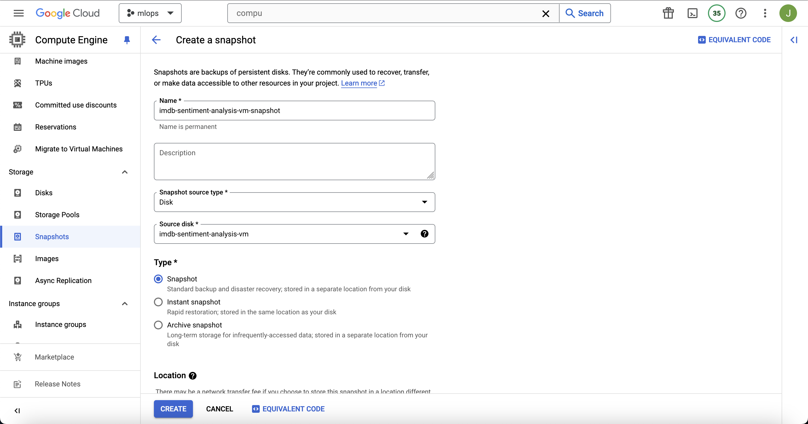
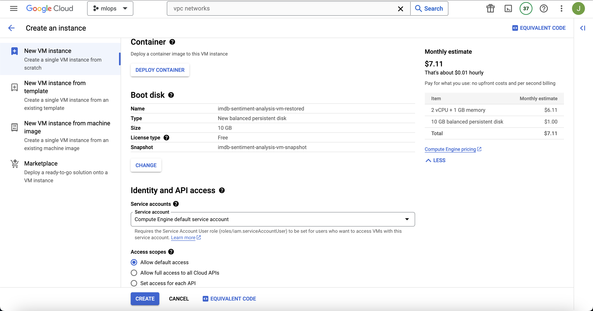
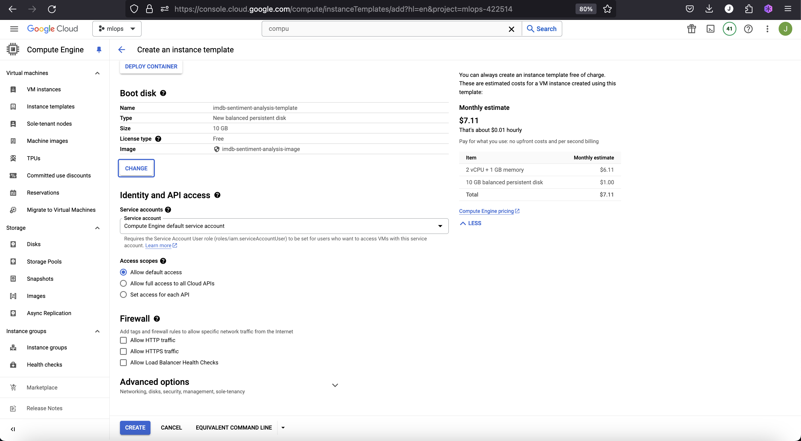
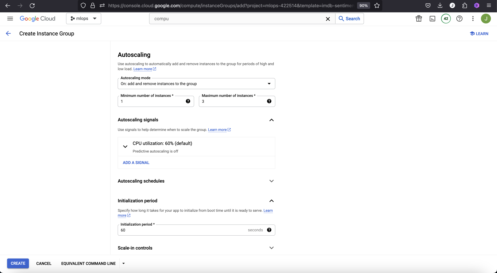
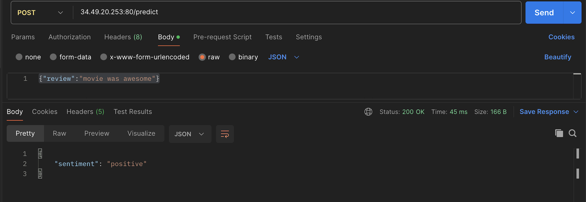
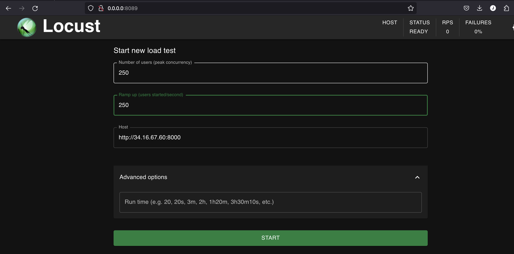
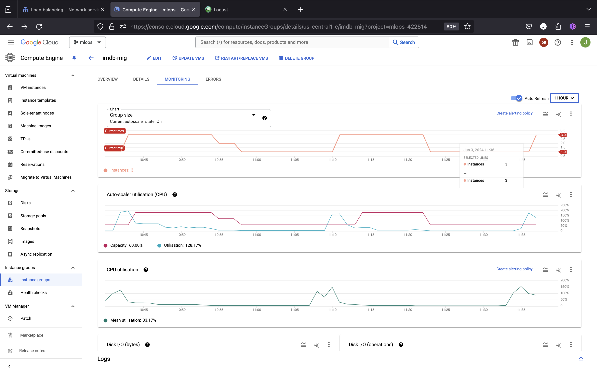

# **Google Cloud Platform Compute Engine - Lab 2**

Watch the video for this lab at our youtube channel [Tutorial Video](https://youtu.be/bvGipcGwtA8)

## **Objective**

This lab focuses on intermediate-level skills in GCP Compute Engine, including creating custom VM images, using snapshots, working with instance templates and managed instance groups (MIGs), configuring networking settings, auto-scaling, load balancing, and load testing. Participants will set up a scalable sentiment analysis web service using FastAPI to classify IMDb reviews.

## **Lab Steps**

### **Step 1: Create a VM Instance and Set Up Environment**

We start by creating a virtual machine (VM) on Google Cloud Platform (GCP). This VM serves as the environment where we will install our dependencies and deploy our sentiment analysis service. Using a VM in GCP provides us with scalable, on-demand computing resources.

1. **Create a VM instance:**
    - Go to the Google Cloud Console: [https://console.cloud.google.com/](https://console.cloud.google.com/).
    - Navigate to Compute Engine > VM instances.
    - Click "Create Instance".
    - Configure the instance:
        - **Name:** `imdb-sentiment-analysis-vm`
        - **Region:** `us-central1`
        - **Zone:** `us-central1-a` (or any other compatible zone in the `us-central1` region)
        - **Machine type:** `e2-micro` (1 vCPU, 1 GB memory)
        - **Boot disk:** Debian GNU/Linux 10 (buster)
        - **Boot disk size:** 10 GB
    - Click "Create".
    

2. **Set up the environment:**
    - SSH into the VM instance.
    - Execute the environment setup script `Lab2/setup.sh` to install necessary packages and set up the virtual environment:
    
    ```sh
    sudo apt-get update
    sudo apt-get install -y python3 python3-pip python3.11-venv git
    mkdir -p /home/imdb-sentiment-analysis
    sudo chmod -R 777 /home/imdb-sentiment-analysis
    cd /home/imdb-sentiment-analysis
    git clone https://github.com/raminmohammadi/MLOps.git 
    cd /home/imdb-sentiment-analysis/MLOps/Labs/GCP_Labs/Compute_Engine_Labs/Lab2  
    python3 -m venv env
    . env/bin/activate
    pip install -r requirements.txt
    ```

This step sets up our VM environment by installing Python and other necessary packages, setting up a Python virtual environment, and cloning the project repository. It ensures that our development environment is isolated and reproducible.

### **Step 2: Create and Use a VM Snapshot**

Snapshots are important as they allow you to back up the state of your VM instance, enabling quick recovery in case of failures. Using snapshots in GCP helps in maintaining business continuity and minimizing downtime.

1. **Create a snapshot of the VM instance:**
    - Stop the VM instance.
    - Go to Compute Engine > Snapshots.
    - Click "Create Snapshot".
    - Configure the snapshot:
        - **Name:** `imdb-sentiment-analysis-vm-snapshot`
        - **Source disk:** `imdb-sentiment-analysis-vm` boot disk
    - Click "Create".
   

2. **Use the snapshot to restore the application in case of failure:**
    - Simulate a failure by deleting the VM instance and confirming the deletion.
    - Restore the snapshot to a new VM instance:
        - Go to Compute Engine > VM instances.
        - Click "Create Instance".
        - Select `New VM instance from snapshot`.
        - Choose the snapshot `imdb-sentiment-analysis-vm-snapshot`.
        - Configure the instance:
            - **Name:** `imdb-sentiment-analysis-vm-restored`
            - **Region:** `us-central1`
            - **Zone:** `us-central1-a` (or the same zone used for the custom VM image)
            - **Machine type:** `e2-micro` (1 vCPU, 1 GB memory)
    - Click "Create"
   

This step demonstrates how to create a backup of the VM's state using a snapshot and how to restore the VM from the snapshot in case of failure. This ensures that our work can be recovered quickly and efficiently.

### **Step 3: Create a Custom VM Image**

Creating a custom image from a VM allows you to capture the VM's configuration and installed software, which can be reused to create new VM instances with the same setup. This is useful for ensuring consistency across multiple instances and for scaling.

1. **Create a custom image from the VM instance:**
    - Deactivate the virtual environment:
    
    ```sh
    deactivate
    ```
    - Stop the VM instance.
    - Go to Compute Engine > Images.
    - Click "Create Image".
    - Configure the image:
        - **Name:** `imdb-sentiment-analysis-image`
        - **Source:** `Disk` > `imdb-sentiment-analysis-vm-restored` boot disk
    - Click "Create"

Creating a custom image from our VM ensures that any new instances created from this image will have the same configuration, software, and environment as the original, thus maintaining uniformity across deployments.

### **Step 4: Configure Networking and Security**

Virtual Private Cloud (VPC) and subnets segment your network into smaller, manageable parts. This helps in organizing and securing your network resources. Firewall rules control the traffic flow to and from your instances, ensuring only authorized access is allowed.

1. **Set up VPC and subnets:**
    - Navigate to VPC Network > VPC Networks.
    - Click "Create VPC Network".
    - Configure the VPC:
        - **Name:** `imdb-sentiment-analysis-vpc`
        - **Subnets:** Custom
        - Click "Add subnet" to add a new subnet:
            - **Name:** `imdb-sentiment-analysis-vpc-subnet`
            - **Region:** `us-central1`
            - **IP address range:** `10.0.0.0/24`
            - **Purpose:** Private
        - Click "Done".
    - Click "Create".

2. **Set up firewall rules:**
    - Navigate to VPC Network > Firewall Rules.
    - Click "Create Firewall Rule".
    - Configure the rule:
        - **Name:** `imdb-sentiment-analysis-vpc-allow-custom`
        - **Network:** `imdb-sentiment-analysis-vpc`
        - **Direction of traffic:** Ingress
        - **Action on match:** Allow
        - **Targets:** All instances in the network
        - **Source IP ranges:** `0.0.0.0/0`
        - **Protocols and ports:**
            - Specified protocols and ports:
                - `tcp:22` (SSH)
                - `tcp:80` (HTTP)
                - `tcp:8000` (for FastAPI)
    - Click "Create".

Setting up a VPC, subnets, and firewall rules organizes and secures our network, ensuring that only legitimate traffic reaches our instances. This helps in protecting our application and data from unauthorized access.

### **Step 5: Create an Instance Template and Managed Instance Group (MIG)**

An instance template allows you to define a configuration for VM instances that can be reused. A managed instance group (MIG) uses an instance template to create and manage a group of identical instances, providing scalability and high availability. This helps in managing large-scale deployments efficiently.

1. **Create a startup script:**
   Create a shell script that activates the virtual environment and runs the FastAPI server. Save this script as `startup-script.sh`:

    ```sh
    #!/bin/bash

    # Navigate to the project directory
    cd /home/imdb-sentiment-analysis/MLOps/Labs/GCP_Labs/Compute_Engine_Labs/Lab2

    # Activate the virtual environment
    . env/bin/activate

    # Start the FastAPI service
    nohup python3 imdb_sentiment_analysis_service.py &
    ```

2. **Create an instance template:**
    - Navigate to Compute Engine > Instance Templates.
    - Click "Create Instance Template".
    - Configure the template:
        - **Name:** `imdb-sentiment-analysis-template`
        - **Machine type:** `e2-micro` (1 vCPU, 1 GB memory)
        - **Boot disk:** Custom image `imdb-sentiment-analysis-image`
        - **Management, security, disks, networking, sole tenancy:**
            - Click "Networking"
            - In the "Networking" tab, select the VPC network `imdb-sentiment-analysis-vpc` and subnet `imdb-sentiment-analysis-vpc-subnet` you created earlier
            - Ensure to remove the pre-existing default vpc 

    - In the "Management, security, disks, networking, sole tenancy" section, find the "Automation" tab.
    - In the "Startup script" section, paste the contents of `startup-script.sh`.
    - Click "Create".
    

3. **Create a managed instance group (MIG):**
    - Go to Compute Engine > Instance Groups.
    - Click "Create Instance Group".
    - Configure the group:
        - **Name:** `imdb-mig`
        - **Location:** Single zone
        - **Zone:** `us-central1-c` (or the same zone used for the custom VM image)
        - **Instance template:** `imdb-sentiment-analysis-template`
        - **Autoscaling policy:**
            - Target CPU utilization: 60%
            - Minimum number of instances: 1
            - Maximum number of instances: 3
    - Click "Create".
    

This step ensures that we have a template to create identical instances and a managed group that can scale based on load. The startup script ensures that each instance starts the FastAPI server automatically.

### **Step 6: Configure Load Balancer**

A load balancer distributes incoming traffic across multiple instances, ensuring high availability and reliability by sending requests only to healthy instances. This helps in managing traffic effectively, providing a better user experience.

1. **Set up a load balancer:**
    - Navigate to **Network Services** > **Load balancing**.
    - Click "Create Load Balancer".
    - Select `HTTP(S) Load Balancing`.
    - Click `Start configuration`.
    - Choose `Global`.

2. **Configure the backend service:**
    - Select `Backend services & backend buckets`.
    - Click `Create a backend service`.
    - Configure the backend service:
        - **Name:** `imdb-backend-service`
        - **Backend type:** `Instance group`
        - **Instance group:** `imdb-mig`
        - **Port numbers:** `8000`
    - Configure the health check:
        - **Protocol:** `HTTP`
        - **Port:** `8000`
        - **Request path:** `/health` (should respond with status: ok)
    - Click `Create`.

3. **Configure the frontend:**
    - Click `Frontends`.
    - Click `Create a frontend IP and port`.
    - Configure the frontend:
        - **Name:** `imdb-frontend`
        - **Protocol:** `HTTP`
        - **IP version:** `IPv4`
        - **Port:** `80`
    - Click `Done`.
  
4. **Finalize and create the load balancer:**
    - Review the configuration.
    - Click `Create`.

Using a load balancer ensures that our application can handle high traffic loads by distributing requests across multiple instances, providing a seamless user experience.

### **Step 7: Auto-scaling and Load Testing**

Auto-scaling automatically adjusts the number of VM instances in a group based on load or other metrics, ensuring that your application can handle varying amounts of traffic. Load testing simulates user traffic to ensure the system can handle real-world usage.

1. **Verify the setup:**
    - The startup script in the MIG will automatically activate the virtual environment and start the FastAPI server.
    - You can SSH into a VM instance from the MIG to check the logs and verify that the server is running.
    - Check the log file `/tmp/startup.log` for any errors.

2. **Test the load balancer:**
    - Send HTTP requests to the load balancer's IP to the `/predict/` endpoint with sample reviews.
      

3. **Load Testing with Locust:**
    - Install locust load testing package:
        - `pip install locust`
    - Create a file named `load_test.py` with the following code:

    ```python
    from locust import HttpUser, TaskSet, task, between

    class UserBehavior(TaskSet):
        @task
        def predict(self):
            self.client.post("/predict/", json={"review": "This movie was fantastic!"})

    class WebsiteUser(HttpUser):
        tasks = [UserBehavior]
        wait_time = between(1, 2)
    ```

    - Run the load test:
    ```sh
    locust -f load_test.py
    ```
    - Open the Locust web interface running at `0.0.0.0:8089` and start the test with the load balancer's IP address.
   

4. **Monitor Auto-scaling:**
    
    - With the simulated load of 200 users and a spawn rate of 200 requests per second, observe scaling to 3 instances.
    - Monitor the instances and performance through the GCP Console to see if new instances are created and traffic is balanced.
    - After the load test, observe the scale-down behavior when the traffic decreases.
    

This step ensures that our application can handle varying loads by automatically scaling the number of instances and distributing the load effectively.

### **Sentiment Analysis Service Code Explanation**

The provided FastAPI code sets up a sentiment analysis service for IMDb reviews. Here's a breakdown of the key components:

```python
from fastapi import FastAPI
from pydantic import BaseModel
import pandas as pd
from sklearn.feature_extraction.text import TfidfVectorizer
from sklearn.linear_model import LogisticRegression
import uvicorn

app = FastAPI()

# Load IMDb dataset
data = pd.read_csv('IMDb_Reviews.csv')

# Preprocess data
X = data['review']
y = data['sentiment']

# Vectorize text data
vectorizer = TfidfVectorizer(max_features=5000)
X_train = vectorizer.fit_transform(X)
model = LogisticRegression()
model.fit(X_train, y)

class Review(BaseModel):
    review: str

@app.post("/predict/")
def predict_sentiment(review: Review):
    X_new = vectorizer.transform([review.review])
    prediction = model.predict(X_new)
    return {"sentiment": prediction[0]}

@app.get("/health")
def health_check():
    return {"status": "ok"}

if __name__ == "__main__":
    uvicorn.run(app, host="0.0.0.0", port=8000)
```

- **FastAPI Setup:** The `FastAPI` instance (`app`) is created to define routes for the application.
- **Data Loading:** The IMDb dataset is loaded into a pandas DataFrame.
- **Data Preprocessing:** The reviews (`X`) and their corresponding sentiments (`y`) are extracted.
- **Text Vectorization:** The text reviews are vectorized using `TfidfVectorizer` to convert them into numerical data suitable for machine learning.
- **Model Training:** A logistic regression model is trained on the vectorized reviews.
- **Prediction Endpoint:** The `/predict/` endpoint takes a review as input, vectorizes it, and returns the predicted sentiment.
- **Health Check Endpoint:** The `/health` endpoint returns a simple status message indicating the service is running.

This setup allows users to send HTTP POST requests to the `/predict/` endpoint with a review and receive a sentiment prediction in response.
