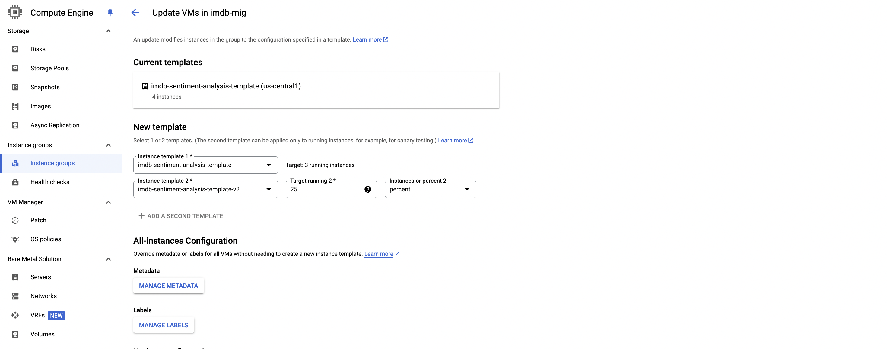
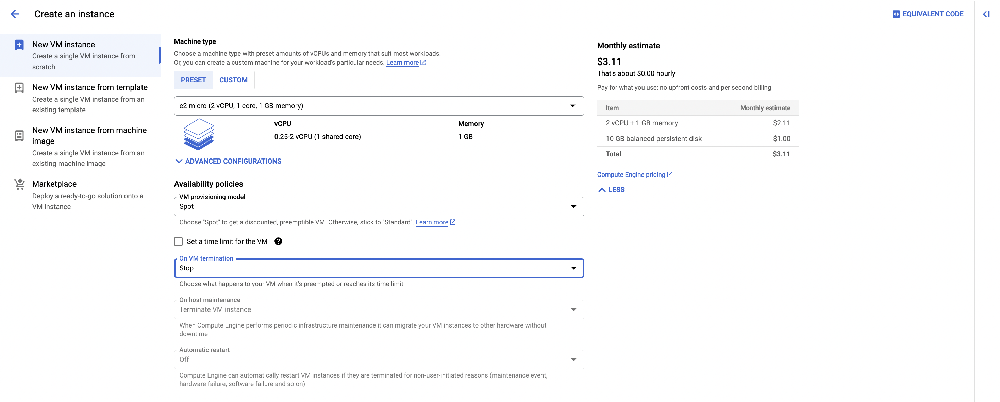
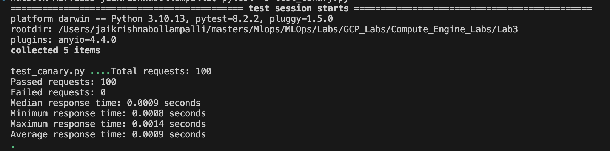
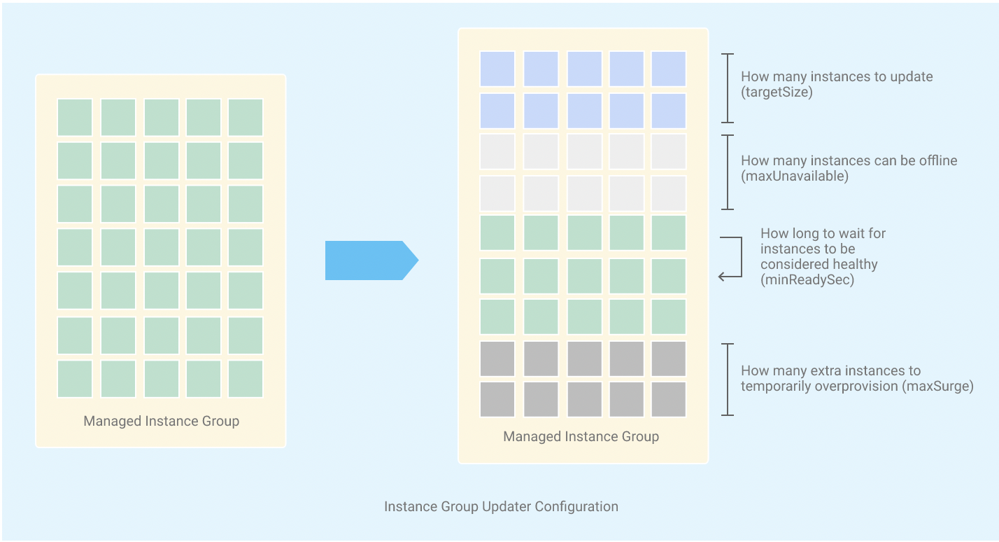
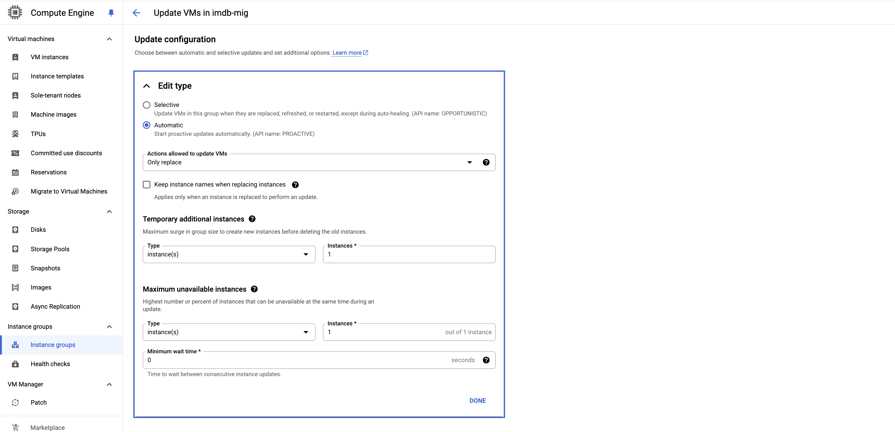

# **Google Cloud Platform Compute Engine - Lab 3**

## **Objective**

This lab focuses on advanced concepts in GCP Compute Engine, performing canary deployments, testing with preemptible VM instances, and rolling updates. Participants will update the sentiment analysis service to include prediction confidence percentage, perform a canary deployment of these updates, test with pytest on a preemptible VM instance, and then roll out the updates.

This lab is a continuation of [Lab 2](https://github.com/raminmohammadi/MLOps/tree/main/Labs/GCP_Labs/Compute_Engine_Labs/Lab2). Please complete Lab 2 before starting this lab.

## **Lab Steps**

### **Step 1: Update VM Instance and Create a New Image**

In Lab 2, we set up an auto-scalable IMDb sentiment analysis service with a managed instance group.We start this lab by updating the VM instance with the new code that includes prediction confidence. We then create a new custom image from this updated VM, which we will use to create new instances in later steps.

1. **Update code on the VM instance:**
    - SSH into the `imdb-sentiment-analysis-vm-restored` instance.
    - Navigate to the project directory:

    ```sh
    cd /home/imdb-sentiment-analysis/MLOps/Labs/GCP_Labs/Compute_Engine_Labs/Lab2
    ```

    - Update the FastAPI service code to include prediction confidence:

    ```python
    from fastapi import FastAPI
    from pydantic import BaseModel
    import pandas as pd
    from sklearn.feature_extraction.text import TfidfVectorizer
    from sklearn.linear_model import LogisticRegression
    import uvicorn

    app = FastAPI()

    # Load IMDb dataset
    data = pd.read_csv('IMDb_Reviews.csv')

    # Preprocess data
    X = data['review']
    y = data['sentiment']

    # Vectorize text data
    vectorizer = TfidfVectorizer(max_features=5000)
    X_train = vectorizer.fit_transform(X)
    model = LogisticRegression()
    model.fit(X_train, y)

    class Review(BaseModel):
        review: str

    @app.post("/predict/")
    def predict_sentiment(review: Review):
        X_new = vectorizer.transform([review.review])
        prediction = model.predict(X_new)
        confidence = round(model.predict_proba(X_new).max() * 100, 2)
        return {"sentiment": prediction[0], "confidence": float(confidence)}

    @app.get("/health")
    def health_check():
        return {"status": "ok"}

    if __name__ == "__main__":
        uvicorn.run(app, host="0.0.0.0", port=8000)
    ```

2. **Create a new custom image (`imdb-sentiment-analysis-image-v2`):**
    - Deactivate the virtual environment:

    ```sh
    deactivate
    ```

    - Stop the VM instance.
    - Go to Compute Engine > Images.
    - Click "Create Image".
    - Configure the image:
        - **Name:** `imdb-sentiment-analysis-image-v2`
        - **Source:** `Disk` > `imdb-sentiment-analysis-vm-restored` boot disk
    - Click "Create".

### **Step 2: Create a New Instance Template**

We create a new instance template using the updated custom image. This template will ensure that any new instances created from it will have the updated code with the prediction confidence feature.

1. **Create a new instance template (`imdb-sentiment-analysis-template-v2`):**
    - Navigate to Compute Engine > Instance Templates.
    - Click "Create Instance Template".
    - Configure the template:
        - **Name:** `imdb-sentiment-analysis-template-v2`
        - **Machine type:** `e2-micro`
        - **Boot disk:** Custom image `imdb-sentiment-analysis-image-v2`
        - **Networking:** VPC network `imdb-sentiment-analysis-vpc` and subnet `imdb-sentiment-analysis-vpc-subnet`
    - Add the startup script in the "Automation" tab:

    ```sh
    #!/bin/bash

    cd /home/imdb-sentiment-analysis/MLOps/Labs/GCP_Labs/Compute_Engine_Labs/Lab2
    . env/bin/activate
    nohup python3 imdb_sentiment_analysis_service.py &
    ```

    - Click "Create".

### **Step 3: Update Managed Instance Group (MIG)**

Updating the instance group configuration ensures we have enough instances to demonstrate canary deployment.

1. **Update the instance group (`imdb-mig`) configuration:**
    - Go to Compute Engine > Instance Groups.
    - Select `imdb-mig`.
    - Click "Edit".
    - Update the autoscaling policy:
        - Minimum number of instances: 4
        - Maximum number of instances: 8
    - Click "Save".

### **Step 4: Canary Deployment**

Performing a canary deployment allows us to test the new version of our application with a subset of instances, reducing risk in case there are issues with the new deployment.

1. **Perform canary deployment using Google Cloud Console:**
    - In the Google Cloud console, go to the Instance groups page.
    - Select the managed instance group (`imdb-mig`) that you want to update.
    - Click "Update VMs".
    - Click "Add a second template" and choose the new instance template (`imdb-sentiment-analysis-template-v2`).
    - Under Target size, enter `25%` to canary the new instance template.
    - Under Update configuration select `automatic` with actions allowed to vm instances set to `replace only` to roll out our updates instantly.
    - Click "Update VMs" to start the update.

    - By adding a second template and setting the target size to 25%, we can update 25% of the instances in the managed instance group to use the new template.
    - Configure `maximum surge` to control the maximum number of additional instances temporarily created during updates, and `maximum unavailable instances` to specify the maximum number of instances that can be unavailable during the update. This ensures a controlled and gradual rollout, reducing risk.



### **Step 5: Test with Preemptible VM Instance**

A preemptible VM instance is a cost-effective compute instance that you can use for fault-tolerant and batch workloads. It is offered at a lower price compared to standard instances, but it can be preempted (terminated) by Google Cloud at any time if the resources are needed elsewhere. This step ensures that the new version of our application works correctly under real-world conditions.

1. **Create a preemptible VM instance:**
    - Go to Compute Engine > VM instances.
    - Click "Create Instance".
    - Configure the instance:
        - **Name:** `imdb-sentiment-analysis-preemptible`
        - **Region:** `us-central1`
        - **Zone:** `us-central1-a`
        - **Machine type:** `e2-micro`
        - **Boot disk:** Debian GNU/Linux 10 (buster)
        - **VM provisioning model:** In the Availability policies section and select `Spot` as the VM provisioning model.
    - Click "Create".
    
    

2. **Run unit tests on the new `v2` canary deployment instance:**
    - SSH into the preemptible VM instance.
    - Install necessary packages:

    ```sh
    sudo apt-get update
    sudo apt-get install -y python3 python3-pip python3.11-venv
    python3 -m venv env
    . env/bin/activate
    pip install requests pytest httpx
    ```

    - Create a test file `test_canary.py` to test the canary deployment:

```python
import httpx
import pytest
from statistics import median
import time

CANARY_INSTANCE_IP = "YOUR_CANARY_INSTANCE_IP"

@pytest.fixture(scope="module")
def client():
    return httpx.Client(base_url=f"http://{CANARY_INSTANCE_IP}:8000")

def test_health_check(client):
    """
    Test to verify the health check endpoint.
    Ensures the service is running and returns the correct status.
    """
    response = client.get("/health")
    assert response.status_code == 200
    assert response.json() == {"status": "ok"}

def test_predict_positive_review(client):
    """
    Test to verify the prediction of a positive review.
    Ensures the service correctly identifies a positive sentiment.
    """
    response = client.post("/predict/", json={"review": "This movie was fantastic!"})
    assert response.status_code == 200
    data = response.json()
    assert "sentiment" in data
    assert "confidence" in data
    assert data["sentiment"] == "positive"

def test_predict_negative_review(client):
    """
    Test to verify the prediction of a negative review.
    Ensures the service correctly identifies a negative sentiment.
    """
    response = client.post("/predict/", json={"review": "This movie was terrible!"})
    assert response.status_code == 200
    data = response.json()
    assert "sentiment" in data
    assert "confidence" in data
    assert data["sentiment"] == "negative"

def test_predict_neutral_review(client):
    """
    Test to verify the prediction of a neutral review.
    Ensures the service correctly handles a neutral sentiment.
    """
    response = client.post("/predict/", json={"review": "This movie was okay."})
    assert response.status_code == 200
    data = response.json()
    assert "sentiment" in data
    assert "confidence" in data

def test_bulk_requests(client):
    """
    Test to send multiple requests and gather metrics.
    Ensures the service handles real-world load effectively.
    """
    positive_reviews = ["This movie was fantastic!", "I loved this movie!", "Best movie ever!"]
    negative_reviews = ["This movie was terrible!", "I hated this movie!", "Worst movie ever!"]
    neutral_reviews = ["This movie was okay.", "It was an average movie.", "Not bad, not great."]

    reviews = positive_reviews + negative_reviews + neutral_reviews
    request_count = 100
    response_times = []
    passed_requests = 0
    failed_requests = 0

    for _ in range(request_count):
        review = reviews[_ % len(reviews)]
        start_time = time.time()
        response = client.post("/predict/", json={"review": review})
        response_time = time.time() - start_time
        response_times.append(response_time)

        try:
            assert response.status_code == 200
            data = response.json()
            assert "sentiment" in data
            assert "confidence" in data

            expected_sentiment = "positive" if review in positive_reviews else "negative" if review in negative_reviews else "neutral"
            assert data["sentiment"] == expected_sentiment

            passed_requests += 1
        except AssertionError:
            failed_requests += 1

    print(f"Total requests: {request_count}")
    print(f"Passed requests: {passed_requests}")
    print(f"Failed requests: {failed_requests}")
    print(f"Median response time: {median(response_times):.4f} seconds")
    print(f"Minimum response time: {min(response_times):.4f} seconds")
    print(f"Maximum response time: {max(response_times):.4f} seconds")
    print(f"Average response time: {sum(response_times)/len(response_times):.4f} seconds")
        
```

 - Run the tests:

    ```pytest -s test_canary.py```

- The tests verify the `/health` and `/predict` endpoints, checking various scenarios like positive, negative, and neutral reviews.
- The bulk test sends multiple requests and gathers metrics such as response times and success rates to ensure the application handles real-world load effectively.
- **Fault Tolerance:** While using preemptible VM instances, implement checkpointing. Save progress to a Google Cloud Storage bucket periodically and resume from checkpoints if interrupted. Use startup scripts to download checkpoints and shutdown scripts to upload them. This ensures computation can continue from the last checkpoint, enhancing reliability.




### **Step 6: Perform Rolling Update**

Performing a rolling update ensures that all instances in the instance group are updated to the new version without downtime, maintaining the availability of our service.



1. **Perform rolling update using Google Cloud Console:**
    - In the Google Cloud console, go to the Instance groups page.
    - Select the managed instance group (`imdb-mig`) that you want to update.
    - Click "Update VMs".
    - Under New template, click the drop-down list and select the new template (`imdb-sentiment-analysis-template-v2`).
    - The target size is automatically set to 100%, indicating that all your instances will be updated.
    - Under Update configuration, expand the selection menu and select Automatic as the Update type. Leave default values for the other options.
    - Configure `maximum surge` to control the maximum number of additional instances temporarily created during updates, and `maximum unavailable instances` to specify the maximum number of instances that can be unavailable during the update. This ensures a controlled and gradual rollout, reducing risk.
    - Click "Update VMs" to start the update.

