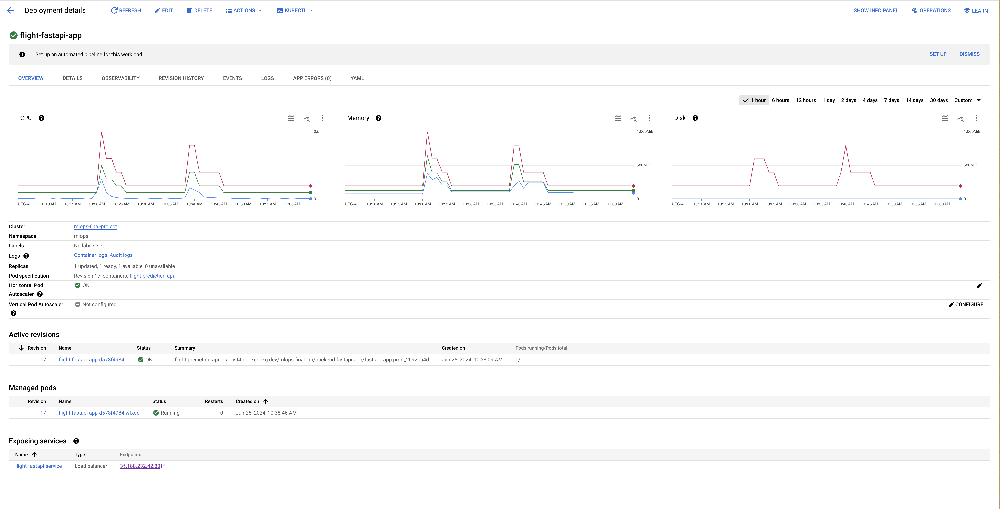

# Flight Delay Prediction Pipeline

This FastAPI application predicts flight delays by utilizing a pre-trained machine learning model. The model, stored as a pickle file in Google Cloud Storage (GCS), is dynamically loaded into the application at runtime.

## Project Structure
```
Flight_Delay_Prediction_Pipeline_Lab/
├── backend/
│ ├── assets/ # Static files like images or JavaScript
│ ├── routers/ # Router files defining API endpoints
│ ├── schemas/ # Pydantic models for data validation
│ ├── utils/ # Utility modules
│ ├── .env # Environment variables
│ └── .env.example # Example environment configuration
├── kubernetes/
│ ├── configMap.yaml # Kubernetes ConfigMap
│ ├── deployment.yaml # Deployment configuration
│ ├── hpa.yaml # Horizontal Pod Autoscaler configuration
│ ├── kustomization.tmpl.yaml # Kustomization template for Kubernetes resources
│ ├── namespace.yaml # Namespace specification
│ └── service.yaml # Service definition
├── .dockerignore # Specifies patterns to ignore in Docker builds
├── Dockerfile # Defines the Docker container
├── main.py # Entry point for the FastAPI application
├── requirements.txt # Python dependencies
└── service_account.json # GCS service account credentials
```

## Setup

### Prerequisites

- Docker
- Kubernetes
- Google Cloud account with access to Google Cloud Storage

### Configuration

1. **Environment Variables:**
   Copy `.env.example` to `.env` and update the variables to match your environment, specifically your GCS bucket and credentials.

2. **GCS Credentials:**
   Ensure `service_account.json` contains the correct credentials to access the GCS bucket where the model pickle file is stored.

### Running the Application

```
uvicorn main:app --port 8080 --reload
```
## Deploying to Kubernetes
#### Apply Kubernetes Configurations:
Adjust the files in the kubernetes/ directory as needed, and then use kubectl to apply them:
```
kubectl apply -k kubernetes/deployment.yaml
```
#### Verify Deployment:

Check the deployment status with:
```
kubectl get all -n mlops
```

## Usage
Once deployed, the application exposes endpoints that allow users to predict flight delays based on the data provided in requests. For detailed API usage, refer to the Swagger UI at http://localhost:8000/docs.

## Github Actions Deployment Pipeline
The GitHub Actions pipeline defined in the YAML file you provided automates the deployment of a FastAPI application to Google Kubernetes Engine (GKE) whenever changes are pushed to the main branch. Below is a breakdown of the key components and steps within this pipeline.

This CI/CD pipeline is designed to facilitate the building and deployment of a FastAPI application using Docker and Google Kubernetes Engine (GKE). It is triggered on a push to the main branch. The pipeline uses two primary jobs: gcr-build and deploy.

### Environment Variables
Several environment variables are set globally:

- SHORT_SHA: A shortened version of the commit SHA, used for tagging Docker images.
- IMAGE_TAG: Fixed tag for the production environment.
- PROJECT_ID: Google Cloud Project ID.
- REGION: Google Cloud region.
- GAR_LOCATION: Google Artifact Registry location for Docker images.

### Jobs

### 1. `gcr-build` - Build and Push to Google Artifact Registry (GAR)

This job handles the building of the Docker image and pushing it to GAR.

- **Check out code**: Fetches the latest code from the `main` branch.
- **Authenticate with Google Cloud**: Uses a Google Cloud service account key stored in GitHub secrets to authenticate.
- **Set up Cloud SDK**: Prepares the Google Cloud SDK environment for use in the workflow.
- **Docker Configuration**: Configures Docker to authenticate with the Google Cloud region-specific Docker registry.
- **Build and Tag Docker Image**: Builds the Docker image using `docker buildx` and tags it with both a fixed production tag and a tag including the short SHA.
- **Push Docker Image**: Pushes the tagged images to Google Artifact Registry.

### 2. `deploy` - Deployment to Google Kubernetes Engine

This job depends on the successful completion of the `gcr-build` job and performs the deployment to GKE.

- **Check out code**: Re-fetches the code, ensuring that the latest version is used for deployment scripts.
- **Authenticate with Google Cloud**: Re-authenticates to Google Cloud.
- **Set up Cloud SDK**: Re-configures the Google Cloud SDK.
- **Install GKE Auth**: Installs the GKE authentication plugin for Kubernetes.
- **Update kube config**: Updates the Kubernetes configuration to point to the specific GKE cluster.
- **Configure Environment**: Prepares environment variables for deployment, notably configuring image tags and registry details.
- **Deploy to GKE**: Applies the Kubernetes configurations to deploy the application using kustomize and kubectl.

### Key Components

- **Docker and Google Artifact Registry**: Used for containerization of the application and storing the Docker images.
- **Google Kubernetes Engine**: The managed service used for deploying and scaling the Kubernetes applications.
- **GitHub Secrets (`GCP_SA_KEY`)**: Used to securely store and use Google Cloud service account credentials.

### Workflow Triggers

- **Push to `main`**: This pipeline is triggered on any push to the `main` branch, ensuring that updates are automatically built and deployed.