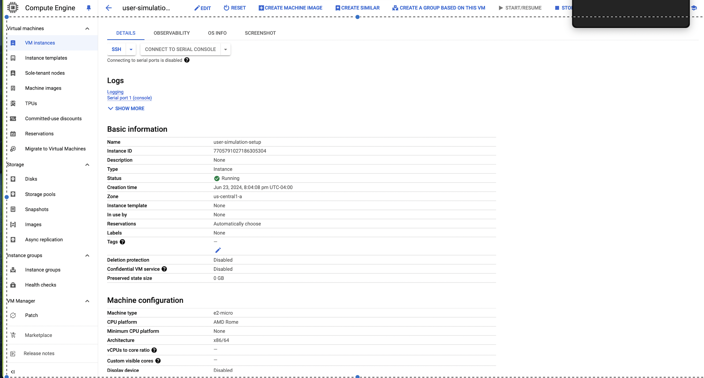
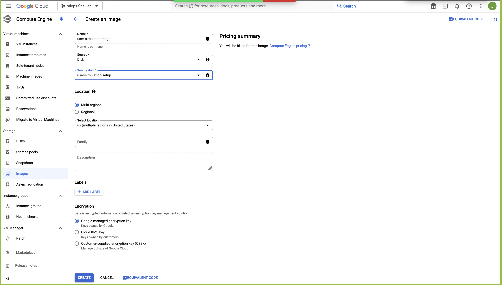
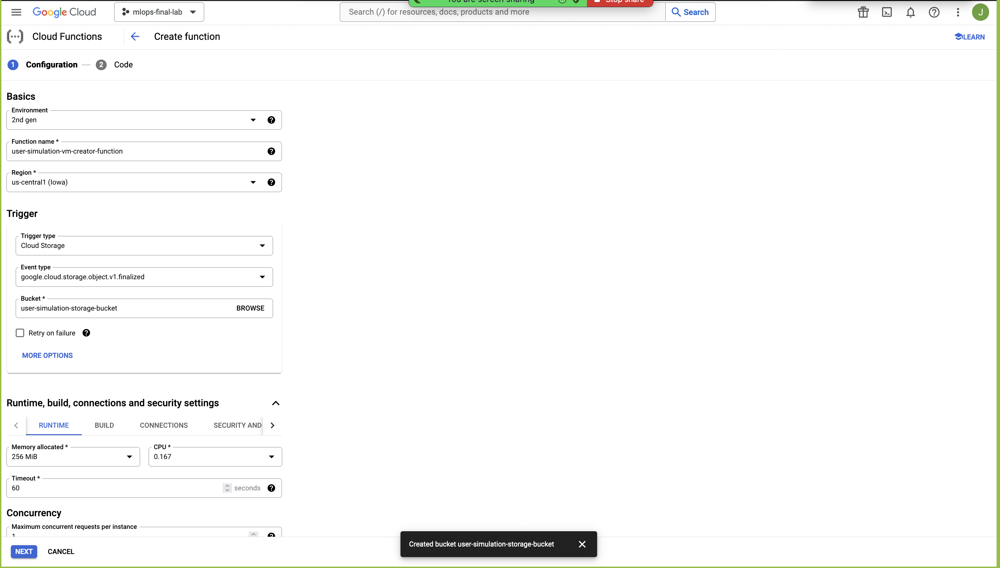
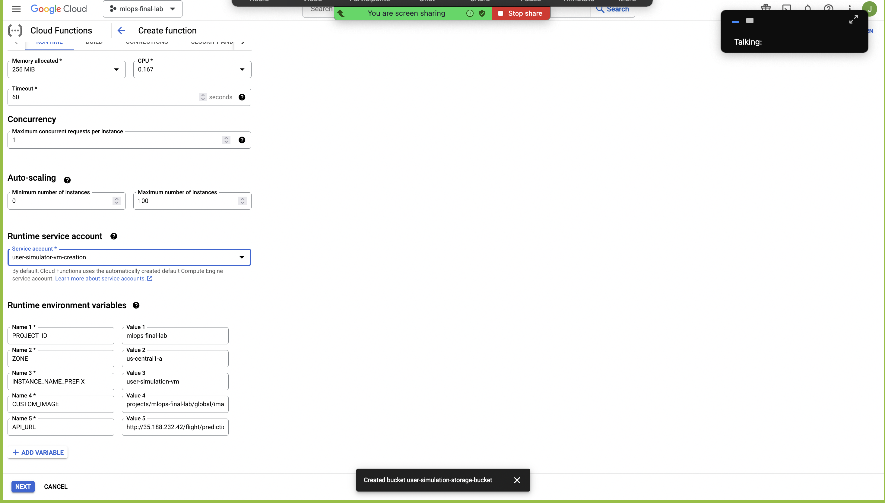
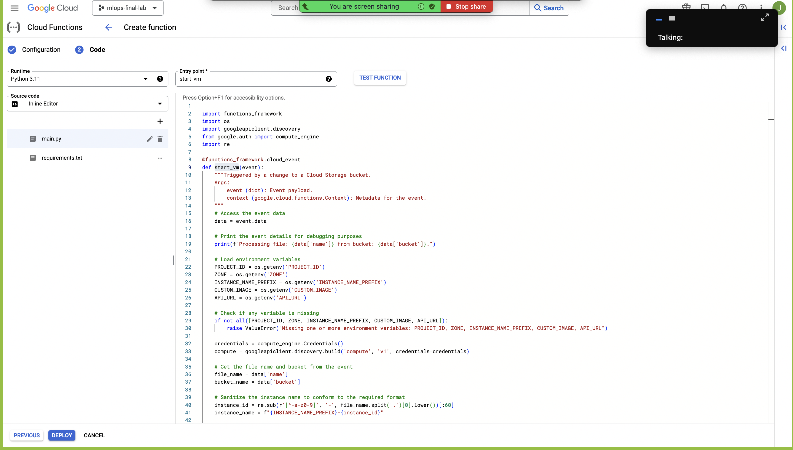
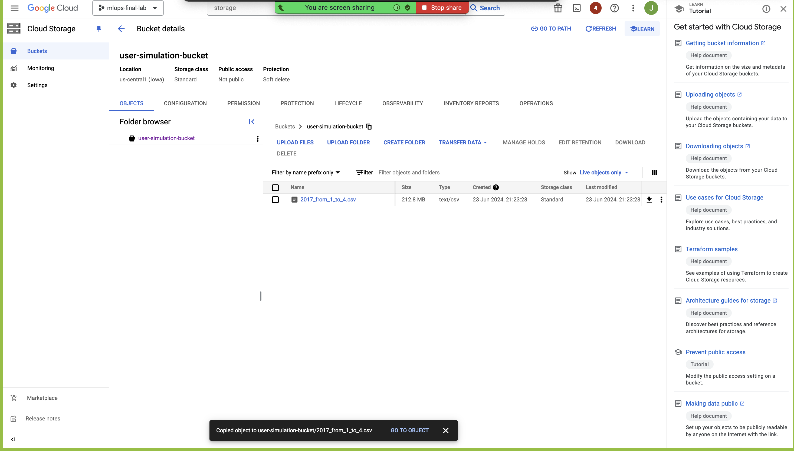
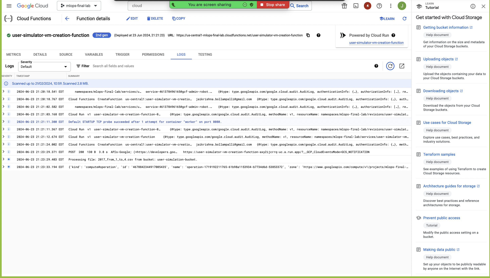
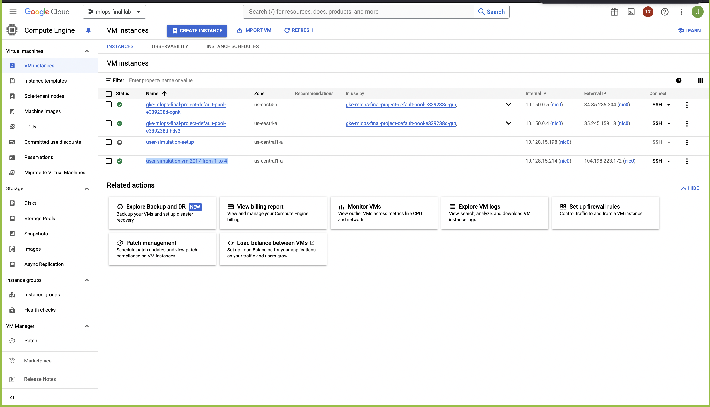
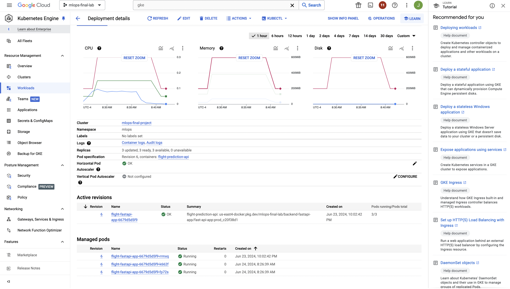
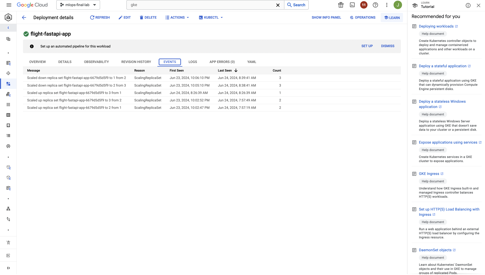

**Fake User Simulation Service**

This guide provides a comprehensive step-by-step approach to set up and run your Fake User Simulation Service using the Google Cloud Console. The objective is to test your flight delay prediction service deployed on Google Kubernetes Engine (GKE) by simulating load and triggering autoscaling.

#### Background

We are setting up this service to simulate user requests and load on our flight delay prediction API deployed on GKE. The goal is to generate traffic to test the performance, reliability, and autoscaling capabilities of our GKE deployment.

1. **Create a VM Instance**:
   - Navigate to the [Google Cloud Console](https://console.cloud.google.com/), go to **Compute Engine** > **VM instances**, and click **Create Instance**.
   - Configure the instance with the following parameters:
     - **Name**: `user-simulation-setup`
     - **Region**: Select your preferred region, e.g., `us-central1`
     - **Zone**: Select your preferred zone, e.g., `us-central1-a`
     - **Machine type**: Choose a suitable machine type, e.g., `e2-micro`
     - **Boot disk**: 
       - **OS**: `Debian GNU/Linux`
       - **Version**: `Debian 10`
   - Click **Create** to create the instance.
   


2. **Install Necessary Software and Set Up the Directory**:
   - SSH into the VM instance from the Google Cloud Console.
   - Run the following commands to set up the environment:
     ```sh
     sudo apt-get update
     sudo apt-get install -y python3 python3-pip python3.11-venv git
     sudo mkdir -p /home/user_simulator
     sudo chmod 777 /home/user_simulator
     cd /home/user_simulator
     python3 -m venv venv
     . venv/bin/activate
     pip install pandas requests tqdm numpy
     ```
   - These commands install Python, pip, virtual environment, and necessary Python packages to ensure the environment is ready for the script execution. Setting up `/home/user_simulator` and its permissions ensures the directory is accessible and ready to store the CSV file and run the script.

3. **Upload the Script**:
   - Upload your `simulate_requests.py` script to the `/home/user_simulator` directory.
   - Set the correct permissions for the script:
     ```sh
     sudo chmod 755 /home/user_simulator/simulate_requests.py
     ```
   - Ensuring the script is present and executable allows the VM to run the script when needed.

4. **Create a Custom Image**:
   - Once the software and script are set up, go back to the Google Cloud Console, navigate to **Compute Engine** > **VM instances**, select your instance (`user-simulation-setup`), and click **Create Image**.
   - Fill in the image details:
     - **Name**: `user-simulator-image`
     - **Source**: Select the disk of the instance you set up
     - **Family**: Leave blank (optional)
     - **Description**: "Custom image for user simulation VM"
   - Click **Create** to create the image.



5. **Create a Service Account**:
   - Go to **IAM & Admin** > **Service accounts**, click **+ CREATE SERVICE ACCOUNT**, and fill in the details:
     - **Service account name**: `user-simulator-vm-creation`
     - **Service account ID**: Automatically filled
     - **Service account description**: "Service account for creating user simulation VMs"
   - Click **Create** and continue.

6. **Grant the Service Account the Necessary Roles**:
   - Add the following roles to the service account:
     - **Compute Admin**
     - **Storage Object Viewer**
     - **Service Account User**
   - These roles provide the necessary permissions for the Cloud Function to create VM instances, read from Cloud Storage, and act as the service account.

7. **Create a Google Cloud Storage Bucket**:
   - Go to **Storage** > **Browser** > **Create Bucket**.
   - Configure the bucket with the following settings:
     - **Name**: `user-simulation-bucket`
     - **Location type**: `Region`
     - **Region**: Select the same region as your VM, e.g., `us-central1`
     - **Storage class**: `Standard`
   - Click **Create** to create the bucket.
   - This bucket will be used to store the CSV files that will trigger the Cloud Function.

8. **Navigate to Cloud Functions**:
   - Go to the [Google Cloud Console](https://console.cloud.google.com/), navigate to **Cloud Functions**, and select your function or create a new one.
   - Click **Create function** or **Edit** an existing function.
    


9. **Set Environment Variables**:
   - Expand the **Environment variables** section and add the following variables:
     - **PROJECT_ID**: `mlops-final-lab`
     - **ZONE**: `us-central1-a`
     - **INSTANCE_NAME_PREFIX**: `user-simulation-vm`
     - **CUSTOM_IMAGE**: `projects/mlops-final-lab/global/images/user-simulator-image`
     - **API_URL**: `http://external_ip/flight/prediction`
   - Using environment variables ensures that the Cloud Function can easily access configuration details without hardcoding them into the function code.



10. **Add Requirements for the Cloud Function**:
    - In `requirements.txt` file for your Cloud Function to specify the necessary dependencies:
      ```
      google-api-python-client
      google-auth
      google-auth-httplib2
      google-auth-oauthlib
      functions-framework
      ```
11. **Update the Cloud Function Code**:
   - Use the following code for your Cloud Function:
```python
    import functions_framework
    import os
    import googleapiclient.discovery
    from google.auth import compute_engine
    import re

    @functions_framework.cloud_event
    def start_vm(event):
        """Triggered by a change to a Cloud Storage bucket.
        Args:
            event (dict): Event payload.
            context (google.cloud.functions.Context): Metadata for the event.
        """
        # Access the event data
        data = event.data

        # Print the event details for debugging purposes
        print(f"Processing file: {data['name']} from bucket: {data['bucket']}.")

        # Load environment variables
        PROJECT_ID = os.getenv('PROJECT_ID')
        ZONE = os.getenv('ZONE')
        INSTANCE_NAME_PREFIX = os.getenv('INSTANCE_NAME_PREFIX')
        CUSTOM_IMAGE = os.getenv('CUSTOM_IMAGE')
        API_URL = os.getenv('API_URL')

        # Check if any variable is missing
        if not all([PROJECT_ID, ZONE, INSTANCE_NAME_PREFIX, CUSTOM_IMAGE, API_URL]):
            raise ValueError("Missing one or more environment variables: PROJECT_ID, ZONE, INSTANCE_NAME_PREFIX, CUSTOM_IMAGE, API_URL")

        credentials = compute_engine.Credentials()
        compute = googleapiclient.discovery.build('compute', 'v1', credentials=credentials)

        # Get the file name and bucket from the event
        file_name = data['name']
        bucket_name = data['bucket']

        # Sanitize the instance name to conform to the required format
        instance_id = re.sub(r'[^-a-z0-9]', '-', file_name.split('.')[0].lower())[:60]
        instance_name = f"{INSTANCE_NAME_PREFIX}-{instance_id}"

        # Ensure the CUSTOM_IMAGE is a full URL
        if not CUSTOM_IMAGE.startswith('projects/'):
            raise ValueError("CUSTOM_IMAGE must be a full URL in the format 'projects/IMAGE_PROJECT/global/images/IMAGE'")

        # Configure the instance properties
        instance_body = {
            'name': instance_name,
            'machineType': f"zones/{ZONE}/machineTypes/n1-standard-1",
            'disks': [
                {
                    'boot': True,
                    'autoDelete': True,
                    'initializeParams': {
                        'sourceImage': CUSTOM_IMAGE
                    }
                }
            ],
            'networkInterfaces': [{
                'network': 'global/networks/default',
                'accessConfigs': [
                    {'type': 'ONE_TO_ONE_NAT', 'name': 'External NAT'}
                ]
            }],
            'metadata': {
                'items': [
                    {
                        'key': 'startup-script',
                        'value': f"""
                            #! /bin/bash
                            # Copy the uploaded file from Cloud Storage to the VM
                            gsutil cp gs://{bucket_name}/{file_name} /home/user_simulator/{file_name}
                            # Set up and activate the virtual environment
                            cd /home/user_simulator
                            . venv/bin/activate
                            # Run the Python script with arguments
                            python3 simulate_requests.py /home/user_simulator/{file_name} {API_URL}
                            # Schedule instance shutdown after script completion
                            sudo shutdown -h now
                        """
                    },
                    {
                        'key': 'shutdown-script',
                        'value': f"""
                            #! /bin/bash
                            gcloud compute instances delete {instance_name} --zone={ZONE} --quiet
                        """
                    }
                ]
            },
            'serviceAccounts': [{
                'email': 'default',
                'scopes': [
                    'https://www.googleapis.com/auth/cloud-platform'
                ]
            }]
        }
        request = compute.instances().insert(
            project=PROJECT_ID,
            zone=ZONE,
            body=instance_body
        )
        response = request.execute()
        print(response)
```
        


12. **Upload a File to the Bucket**:
    - Go to **Storage** > **Browser** > your bucket and upload a CSV file. This will trigger the Cloud Function.



13. **Monitor the Cloud Function and VM**:
    - Check the logs in **Cloud Functions** to see if the function was triggered.
    - Go to **Compute Engine** > **VM instances** to see if a new instance was created and is processing the data.





14. **Check the Logs**:
    - SSH into the VM instance created by the Cloud Function and check the `simulation.log` file located in `/home/user_simulator` to verify that the script ran successfully and processed the data.

15. **Monitor GKE Autoscaling**:
    - Navigate to **Kubernetes Engine** > **Clusters** in the Google Cloud Console.
    - Select your GKE cluster and go to the **Workloads** tab.
    - Monitor the number of replicas for your flight delay prediction service to see if autoscaling is triggered in response to the simulated load.
    - Check the **Logs** tab to see the incoming requests and responses to ensure that the service is handling the load correctly and that autoscaling is functioning as expected.





By following these steps, you ensure that the Cloud Function triggers the creation of a VM instance, passes the necessary arguments to the simulator script, processes the uploaded CSV file, logs the necessary information, and monitors the autoscaling of your GKE deployment. Adjust the configurations and scripts according to your specific needs and environment.