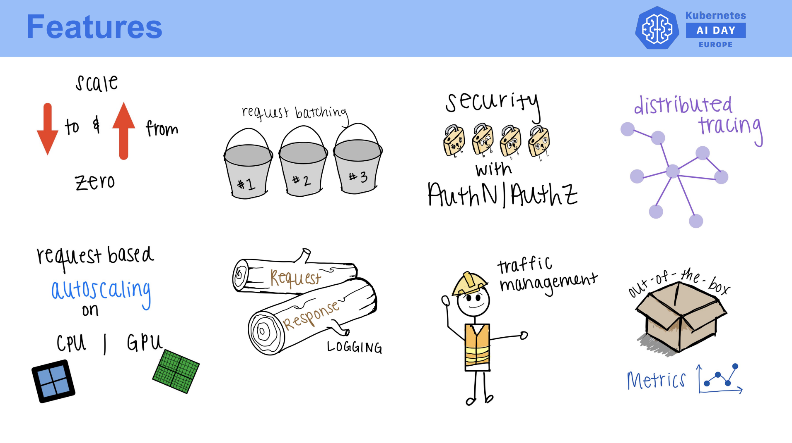
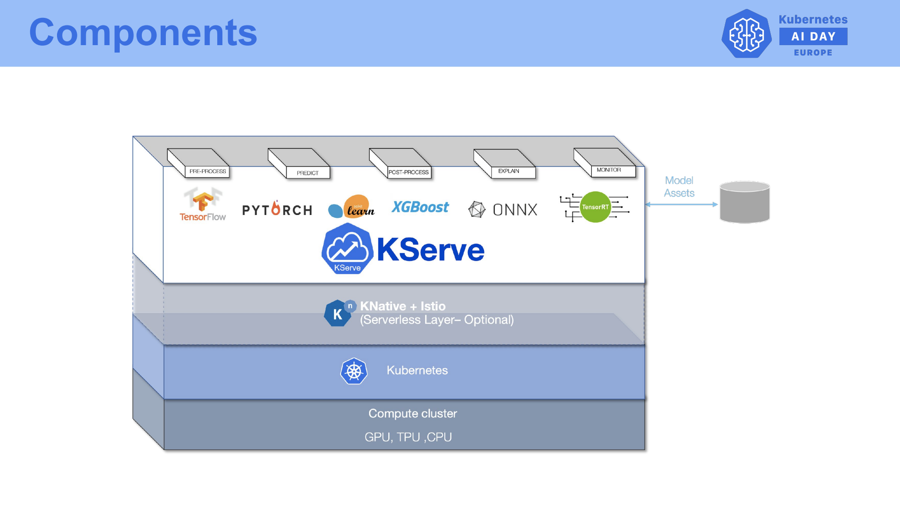

# **Introduction to KServe and Kubernetes**

## KServe and Kubernetes

This ReadMe will walk you through the basics of KServe, its integration with Kubernetes, and how to set up a Kubernetes cluster using Google Cloud Platform (GCP).

## **Overview of KServe**

**KServe is an open-source platform designed to deploy machine learning models on Kubernetes. It simplifies the process by providing a standardized interface for serving models across various frameworks like TensorFlow, PyTorch, and Scikit-learn.**

- **Model Lifecycle:** KServe manages the entire lifecycle of model serving, from scaling deployments to managing versioning and traffic routing. It ensures efficient and reliable model serving.

## **Basic Concepts of Kubernetes**

Kubernetes is a powerful container orchestration platform that automates the deployment, scaling, and management of containerized applications.

- **Core Components:** Kubernetes organizes containers into Pods, schedules them onto Nodes, and manages their lifecycle within a Cluster. This makes it ideal for deploying scalable machine learning models.

## **How KServe Integrates with Kubernetes**

KServe leverages Kubernetes' capabilities to provide seamless model serving:

- **InferenceServices:** Uses Custom Resource Definitions (CRDs) to manage model endpoints.
- **Integration with Istio and Knative:** Ensures automatic scaling based on demand while maintaining high availability.

## **Setting Up a GCP Kubernetes Cluster**

To set up a Kubernetes cluster using Google Cloud Platform's Google Kubernetes Engine (GKE):

1. **Google Cloud Console:**
    - Log in and navigate to the 'Kubernetes Engine' section.
    - Select your project or create a new one.
    - Click 'Create' to start the cluster creation process.
    - Choose 'Zonal' for location type, select your preferred zone, and configure settings like node pool size.
2. **Using `gcloud` Command-Line Tool:**
    - Run: **`gcloud container clusters create [CLUSTER_NAME] --zone [ZONE]`**
    - Replace **`[CLUSTER_NAME]`** and **`[ZONE]`** with your desired cluster name and zone.

   ## **Installation Guide for gcloud CLI and kubectl**

   This guide will help you install the **gcloud CLI** and **kubectl** to manage your Google Cloud Platform resources and Kubernetes clusters.

   ### **Installing gcloud CLI**

    1. **Download and Install:**
        - Visit the [Google Cloud SDK installation page](https://cloud.google.com/sdk/docs/install) for detailed instructions.
        - For Linux:

          `bashcurl -O https://dl.google.com/dl/cloudsdk/channels/rapid/downloads/google-cloud-cli-386.0.0-linux-x86_64.tar.gz
          tar -xf google-cloud-cli-386.0.0-linux-x86_64.tar.gz
          ./google-cloud-sdk/install.sh`

        - For Windows, download the installer from the Google Cloud SDK page and follow the setup instructions[7](https://www.youtube.com/watch?v=rpmOM5jJJfY).
    2. **Initialize gcloud:**
        - Run the following command to initialize:

          `bash./google-cloud-sdk/bin/gcloud init`

    3. **Add to PATH:**
        - Make sure to add the gcloud CLI to your PATH for easy access.

   ### **Installing kubectl**

    1. **Using gcloud CLI:**
        - After installing the Google Cloud SDK, install kubectl by running:

          `bashgcloud components install kubectl`

    2. **Verify Installation:**
        - Check that kubectl is installed correctly by running:

          `bashkubectl version --client`

    3. **Alternative Methods:**
        - You can also install kubectl using package managers like **`apt`**, **`yum`**, or **`brew`** for macOS

## **Conclusion**

In this guide, we introduced you to KServe and its integration with Kubernetes. We also demonstrated how to set up a GCP-based Kubernetes cluster using GKE. In our next guide, we'll dive deeper into installing KServe on this cluster.

## **References**

For more detailed information, please refer to the official documentation:

- [KServe Documentation](https://kserve.github.io/website/)
- [Kubernetes Documentation](https://kubernetes.io/docs/home/)
- [Google Cloud SDK Documentation](https://cloud.google.com/sdk/docs)