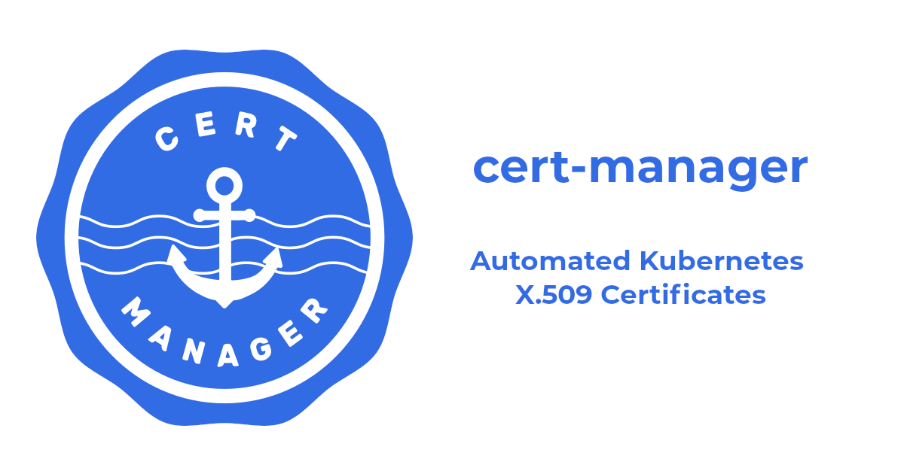

## Installing KServe on Google Cloud Platform (GCP)

This ReadMe will walk you through the process of installing KServe on a Kubernetes cluster hosted on Google Cloud Platform. We will cover setting up Istio, Cert Manager, and deploying KServe in RawDeployment mode.


### Setting Up Your Environment

Before starting, ensure you have a Kubernetes cluster set up on GCP using Google Kubernetes Engine (GKE). If you haven't done this yet, please refer to the previous video or documentation for detailed instructions.

#### Prerequisites

- **Google Cloud SDK**: Ensure you have the `gcloud` command-line tool installed and configured. Refer to the [Google Cloud SDK installation guide](https://cloud.google.com/sdk/docs/install) for more details.
- **Kubernetes Cluster**: Set up a Kubernetes cluster on GCP.
- **kubectl**: Ensure you have `kubectl` installed to interact with your Kubernetes cluster. You can install it as part of the Google Cloud SDK or separately.

#### Connect to Your Cluster

Use the following command to connect to your Kubernetes cluster:

```bash
gcloud container clusters get-credentials [CLUSTER_NAME] --zone [ZONE]
```

Replace `[CLUSTER_NAME]` and `[ZONE]` with your specific details.

### Setting Up Istio


First, we need to install Istio. Make sure your Kubernetes version is compatible with the recommended Istio version. For Kubernetes 1.27, use Istio 1.18 or 1.19.

#### Download and Install Istio

1. **Download Istio**: Go to the [Istio release page](https://istio.io/downloadIstio) to download the installation file for your OS, or download and extract the latest release automatically (Linux or macOS):

   ```bash
   curl -L https://istio.io/downloadIstio | sh -
   ```

2. **Move to the Istio Package Directory**: For example, if the package is `istio-1.23.2`:

   ```bash
   cd istio-1.23.2
   ```

3. **Add istioctl to Your Path**: Add the `istioctl` client to your path (Linux or macOS):

   ```bash
   export PATH=$PWD/bin:$PATH
   ```

4. **Install Istio Using the Default Profile**: The simplest option is to install the default Istio configuration profile using the following command:

   ```bash
   istioctl install
   ```

5. **Fetch External IP Address or CNAME**: After installation, run this command to get the external IP address or CNAME:

   ```bash
   kubectl --namespace istio-system get service istio-ingressgateway
   ```

#### Create IngressClass Resource

Once Istio is installed, create an IngressClass resource for Istio with the following YAML configuration:

```yaml
apiVersion: networking.k8s.io/v1
kind: IngressClass
metadata:
  name: istio
spec:
  controller: istio.io/ingress-controller
```

### Installing Cert Manager


Cert Manager is required for provisioning webhook certificates in production environments.

#### Install Cert Manager

The default static configuration can be installed as follows:

```bash
kubectl apply -f https://github.com/cert-manager/cert-manager/releases/download/v1.15.3/cert-manager.yaml
```

For more details, refer to the [Cert Manager installation guide](https://cert-manager.io/docs/installation/).

### Installing KServe

Now, let's install KServe and change the default deployment mode to RawDeployment before proceeding.

#### Apply KServe YAML

Install KServe on your cluster using the following command:

```bash
kubectl apply -f https://github.com/kserve/kserve/releases/download/v0.13.0/kserve.yaml
```

#### Install Default Serving Runtimes

Next, install the default serving runtimes for KServe:

```bash
kubectl apply -f https://github.com/kserve/kserve/releases/download/v0.13.0/kserve-cluster-resources.yaml
```

### Configuring Deployment Mode and Ingress

Modify the ConfigMap to set RawDeployment as the default deployment mode:

```bash
kubectl patch configmap/inferenceservice-config -n kserve --type=strategic -p '{"data": {"deploy": "{\"defaultDeploymentMode\": \"RawDeployment\"}"}}'
```

Update the ingress configuration to use the IngressClass created earlier:

```yaml
ingress: |-
  {
    "ingressClassName": "istio",
    "ingressGateway": "istio-system/istio-ingressgateway",
    "ingressService": "istio-ingressgateway.istio-system.svc.cluster.local"
  }
```

Alternatively, apply this patch:

```bash
kubectl patch configmap/inferenceservice-config -n kserve --type=strategic -p '{"data": {"ingress": "{\"ingressClassName\": \"istio\", \"ingressGateway\": \"istio-system/istio-ingressgateway\", \"ingressService\": \"istio-ingressgateway.istio-system.svc.cluster.local\"}"}}'
```

### Verifying Installation

Finally, verify that all components are running correctly by checking the pods in their respective namespaces:

```bash
kubectl get pods -n istio-system
kubectl get pods -n cert-manager
kubectl get pods -n kserve-system
```

In this guide, we installed KServe on GCP using RawDeployment mode with Istio and Cert Manager. You're now ready to deploy machine learning models.

### References:
- https://cloud.google.com/sdk/docs/install
- https://istio.io/latest/docs/tasks/traffic-management/ingress/ingress-control/
- https://kserve.github.io/website/latest/admin/kubernetes_deployment/
- https://cert-manager.io/docs/installation/kubectl/
- https://cert-manager.io/docs/installation/