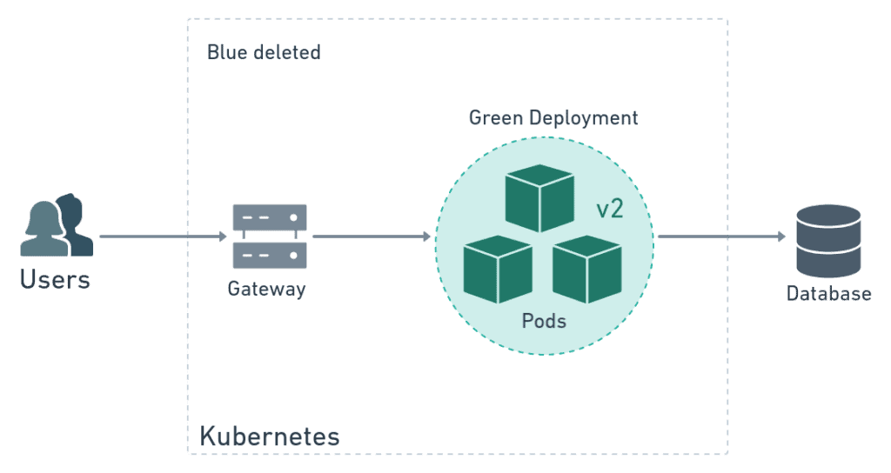
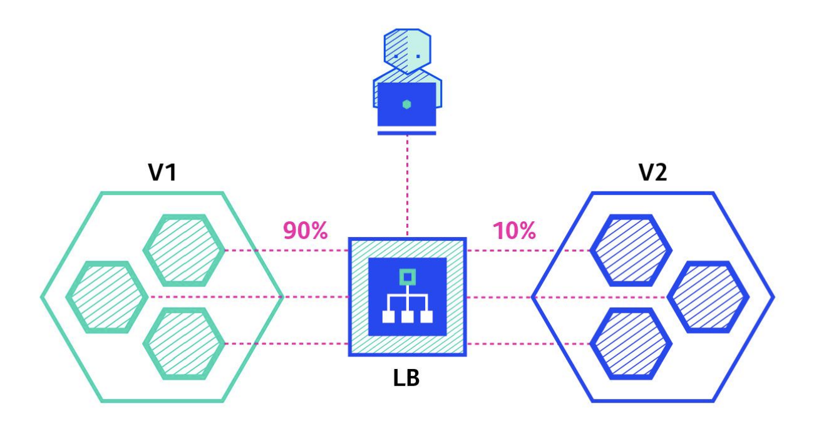

# Advance Deployment Strategies
This Readme provides an overview and implementation steps for three advanced deployment strategies: Rolling Updates, Blue-Green Deployments, and Canary Deployments. These strategies are designed to help you deploy applications with minimal downtime and ensure a smooth transition between application versions.

Watch the tutorial video for this lab on our Youtube channel [Tutorial Video](https://youtu.be/6PhK96XLjXw)

## Rolling Updates
Rolling updates allow you to update parts of your application incrementally without downtime, replacing old versions with new ones gradually.

### Steps to Implement Rolling Updates
#### Initial Deployment:
- Deploy your application normally with multiple replicas to ensure availability.
- Example command: `kubectl apply -f deployment.yaml`

#### Update Your Application:
- Modify your application's image version in your deployment configuration.
- Apply the updated configuration.
  Example command:
```
kubectl set image deployment/fastapi-app fastapi-app-container=heyitsrj/mlops-fastapi-app:v2 -n mlops
```

#### Monitor the Rollout
- Use monitoring tools to watch the deployment status.
- Example command:
  ` kubectl rollout status deployment/myapp`

#### Verify the Update:
Ensure that the new version is serving traffic as expected.

#### Rollback if Necessary:

- If the update fails, rollback to the previous version.
  Example command:
  `kubectl rollout undo deployment/myapp`


### You can set two optional parameters that define how the rolling update takes place:

**MaxSurge**: specifies the maximum number of pods that a deployment can create at one time. This is equivalent to the deployment window. You can specify MaxSurge as an integer or as a percentage of the desired total number of pods. If it is not set, the default is 25%.

**MaxUnavailable**: specifies the maximum number of pods that can be taken offline during rollout. It can be defined either as an absolute number or as a percentage.

Example (under spec in deployment.yaml):
```yaml
​​strategy: 
    type: RollingUpdate
    rollingUpdate:
      maxSurge: 1
      maxUnavailable: 0
```

## Blue-Green Deployments
Blue-Green Deployments involve maintaining two identical environments, one active (Blue) and one idle (Green), to ensure zero downtime during updates.

### Steps to Implement Blue-Green Deployments
#### Setup Blue and Green Environments:
Deploy two identical environments. Initially, route all traffic to the Blue environment.

`kubectl apply -f deployment-blue.yaml`


#### Deploy the New Version to Green:
Update the application in the Green environment only.

`kubectl apply -f deployment-green.yaml`


#### Test the Green Environment:
Perform thorough testing on the Green setup to ensure it is ready for production.
#### Switch Traffic:
Once confirmed, switch the traffic from Blue to Green using a router or load balancer.


#### Monitor the Green Environment:
Ensure everything is running smoothly in the Green environment. If everything looks good, then just delete the Blue environment.


#### Fallback Strategy:
If issues arise, switch back to the Blue environment.

## Canary Deployments
Canary Deployments allow rolling out the change to a small subset of users before a full rollout.

### Steps to Implement Canary Deployments
#### Deploy the Canary Version:
Introduce the new version to a small percentage of your total traffic.
#### Monitor Performance:
Closely monitor the performance and stability of the canary release.
#### Increase Traffic Gradually:
If the canary proves stable, gradually increase the percentage of traffic it handles.
#### Full Rollout:
Once satisfied, roll out the update to all users.
#### Rollback if Needed:
If the canary deployment fails, rollback quickly to the stable version.

## Conclusion
Each of these strategies has its own strengths and is suitable for different scenarios. By following the steps outlined above, you can ensure that your deployments are smooth and user disruptions are minimized.

