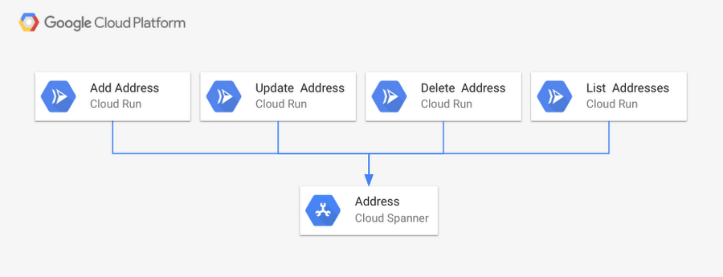

# Compute Engine or Kubernetes Engine? 

Google Cloud wants you to be able to use the cloud on your terms, and we provide a range of computing architectures to meet you where you are. In practice, this often means choosing between Compute Engine and Google Kubernetes Engine (GKE). But, which one will best serve your needs?

If you're used to managing virtual machines (VMs) in your on-premises environment or other clouds, and want a similar experience in Google Cloud, then Compute Engine is for you. It offers scale, performance, and value so you can easily launch large compute clusters on Google's infrastructure. Compute Engine also lets you build predefined VMs or tailor custom machine types to your specific needs.

If you’re working with containers, and need to coordinate more than one in your solution, then GKE—our managed, production-ready environment for deploying containerized applications—is your best choice. It uses our latest innovations in developer productivity, resource efficiency, automated operations, and open source flexibility to help you accelerate your time-to-production.

Of course, your cloud architecture will look very different depending on whether you build it with VMs (Compute Engine) or containers (GKE).

# Google Kubernetes Engine vs Cloud Run: Which should you use?

When it comes to managed Kubernetes services, Google Kubernetes Engine (GKE) is a great choice if you are looking for a container orchestration platform that offers advanced scalability and configuration flexibility. GKE gives you complete control over every aspect of container orchestration, from networking, to storage, to how you set up observability—in addition to supporting stateful application use cases. However, if your application does not need that level of cluster configuration and monitoring, then fully managed Cloud Run might be the right solution for you.

Fully managed Cloud Run is an ideal serverless platform for stateless containerized microservices that don’t require Kubernetes features like namespaces or node allocation and management.

### Why Cloud Run?
The managed serverless compute platform Cloud Run provides a number of features and benefits: 

    - Easy deployment of microservices. A containerized microservice can be deployed with a single command without requiring any additional service-specific configuration.
    - Simple and unified developer experience. Each microservice is implemented as a Docker image, Cloud Run’s unit of deployment.
    - Scalable serverless execution. A microservice deployed into managed Cloud Run scales automatically based on the number of incoming requests, without having to configure or manage a full-fledged Kubernetes cluster. Managed Cloud Run scales to zero if there are no requests, i.e., uses no resources. 
    - Support for code written in any language. Cloud Run is based on containers, so you can write code in any language, using any binary and framework.

Cloud Run is available in two configurations: as a **fully managed Google Cloud service**, and as **Cloud Run for Anthos** (this option deploys Cloud Run into Anthos GKE cluster). If you're already using Anthos, Cloud Run for Anthos can deploy containers into your cluster, allowing access to custom machine types, additional networking support, and GPUs to enhance your Cloud Run services. Both managed Cloud Run services and GKE clusters can be created and managed completely from the console as well as from the command line. 

The best part is you can easily change your mind later, switching from managed Cloud Run to Cloud Run for Anthos or vice versa without having to reimplement your service.

### A Cloud Run use case:
To illustrate these points, let’s take a look at an example use case, a service that adds, updates, deletes and lists addresses.

    You can implement this address management service by creating one containerized microservice for each operation. Then, once the images have been created and registered in a container registry, you can deploy them to managed Cloud Run with a single command. After executing four commands (one deployment for each microservice), the service is up and running on a completely serverless platform. The following figure shows the deployment using Cloud Spanner as the underlying database.

For use cases such as this one, managed Cloud Run is a great choice as the address management service does not require complex configurations as supported by Kubernetes. Nor does this address management service need 24/7 cluster management and operational supervision. Running this address management service as containers in managed Cloud Run is the better production workload strategy.

As a managed compute platform, managed Cloud Run supports essential configuration settings: the maximum concurrent requests a single container receives, the memory size to be allocated to the container as well as request timeout can be configured. No additional configurations or management operations are required.

## The right tool for the job
    Both managed Cloud Run and GKE are powerful offerings for different use cases. Make sure to understand your functional and non-functional service requirements like ability to scale to zero or ability to control detailed configuration before choosing one over the other. 

    In fact, you might want to use both at the same time. An enterprise might have complex microservice-based applications that require advanced configuration features of GKE, and some that do not, but that still want to take advantage of Cloud Run’s ease of use and scalability.

