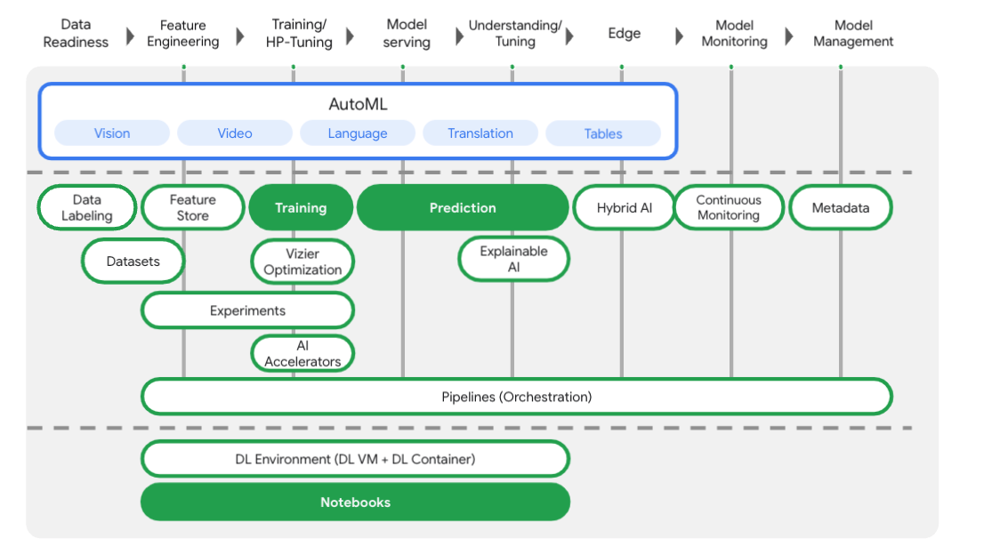
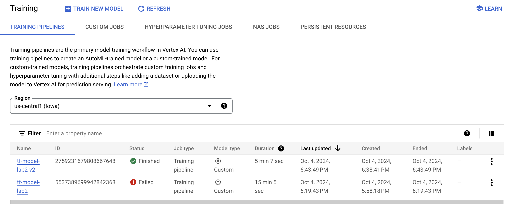

# Vertex AI: Training, Serving, and Monitoring a Custom Model 

## Overview
In this lab, we guide you through creating, training, serving, and monitoring a model using a custom container in Vertex AI. We will explore the flexibility custom containers offer in managing compute resources and model code, enabling deployment with any ML framework. The objectives include building and containerizing model training code, submitting a training job to Vertex AI, deploying the model to an endpoint, and setting up monitoring for predictions. Follow along as we dive into the process step by step.



## Learning Objectives
- Build and containerize model training code in Vertex Notebooks.
- Submit a custom model training job to Vertex AI.
- Deploy your trained model to an endpoint and use that endpoint to get predictions.
- Monitoring input data and predictions

## Steps to Run the Lab

### Task 1: Set Up Your Environment
1. Sign in to GCP console.
2. Open the Google Cloud Console and sign in using the lab credentials.
3. Enable the following APIs:
   - Compute Engine API
   - Vertex AI API
   - Container Registry API
4. Launch a Vertex AI Notebooks instance:
   - Navigate to Vertex AI > Workbench.
   - Create a new notebook instance with TensorFlow Enterprise 2.11.


### Task 2: Containerize Training Code

We are going to submit training job to Vertex by putting our training code in a Docker container and pushing it container to Google Container Registry. Using this approach, we can train a model built with any framework.

1. create a directory
2. Create a Dockerfile
3. Add the necessary commands to your Dockerfile (see lab details for the complete Dockerfile content).
4. Create a Cloud Storage bucket to export your trained model:
   ```bash
   PROJECT_ID='your-cloud-project'
   BUCKET_NAME="gs://${PROJECT_ID}-bucket"
   gsutil mb -l "REGION" $BUCKET_NAME
   ```
5. Create a directory for your training code and a Python file:
   ```bash
   mkdir trainer
   touch trainer/train.py
   ```
6. Add your model training code in `train.py` (see lab details for the complete code).

### Task 3: Run a Training Job on Vertex AI
1. Build and test the container locally:
   ```bash
   IMAGE_URI="gcr.io/$PROJECT_ID/mpg:v1"
   docker build ./ -t $IMAGE_URI
   docker run $IMAGE_URI
   docker push $IMAGE_URI
   ```
2. Kick off the training job:
   - Navigate to the Model Registry section in Vertex AI and create a new training job using the custom container.



### Task 4: Deploy a Model Endpoint
1. Once training is complete, deploy the model to an endpoint:
   - Go to the Model Registry, select your model, and click Deploy & Test.
   - Create a new endpoint and configure the deployment settings.
     
2. Get predictions from the deployed model using the Vertex AI API in a Python notebook:
   ```python
   !pip3 install google-cloud-aiplatform --upgrade --user
   from google.cloud import aiplatform
   endpoint = aiplatform.Endpoint(endpoint_name="projects/YOUR-PROJECT-NUMBER/locations/REGION/endpoints/YOUR-ENDPOINT-ID")
   response = endpoint.predict([test_mpg])
   print('API response: ', response)
   print('Predicted MPG: ', response.predictions[0][0])
   ```


#### Model Monitoring

Vertex AI Model Monitoring lets us run monitoring jobs as needed or on a regular schedule to track the quality of your tabular models. If we've set alerts, Vertex AI Model Monitoring informs when metrics surpass a specified threshold.

Vertex AI Model Monitoring can track and alert us when deviations exceed a specified threshold. We can then re-evaluate or retrain your model to ensure the model is behaving as intended.


## Conclusion
We have successfully trained and deployed a TensorFlow model using Vertex AI and a custom container. We can now make predictions using the deployed model endpoint.
