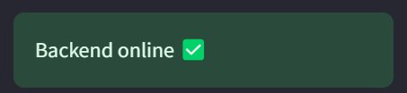
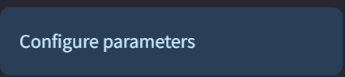
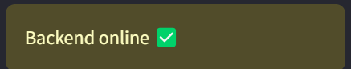
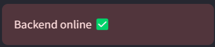
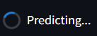
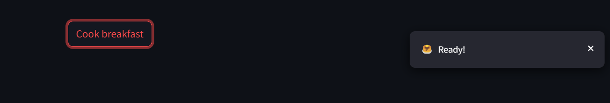

## Streamlit Introduction

Data Science models often need to be shared and presented in an interactive manner for various applications. Streamlit provides a convenient platform to build user-friendly interfaces, allowing practitioners to showcase their remarkable machine learning models to a broader audience effectively.

## Lab objective
Before we move forward, we highly recommend completing the [FastAPI_Labs](../FastAPI_Labs/src/) if you haven't already. The FastAPI Labs will teach you how to train and host your own machine learning classification model. In this new lab, we'll build upon what you learned and add a clean, user-friendly interface to interact with your model.

## Install Streamlit

You will need to install streamlit for the next sections

1. `pip install streamlit`

## Hello World in Streamlit

The best way to explore a new package is to start with the `hello world` equivalent. So, to run the streamlit application,

```
streamlit hello
```

This will start a server on default port `8501` with an interactive dashboard. The hello world streamlit dashboard showcases some intresting usecases, so don't forget to click around and explore further.


## Building the UI Step-by-step
When creating a dashboard, the initial phase involves determining its layout structure. For this particular demonstration, we will incorporate a side panel and a primary body section. The side panel will serve as a navigation tool, enabling us to access various pages within the application, monitor the health of the backend system, and input test features for the model.

### Building the sidebar
```Python
import json
import requests
import streamlit as st
from pathlib import Path
from streamlit.logger import get_logger
FASTAPI_BACKEND_ENDPOINT = "http://localhost:8000"
FASTAPI_IRIS_MODEL_LOCATION = Path(__file__).resolve().parents[2] / 'FastAPI_Labs' / 'src' / 'iris_model.pkl'
LOGGER = get_logger(__name__)
def run():
    st.set_page_config(
        page_title="Iris Flower Prediction Demo",
        page_icon="🪻",
    )
    with st.sidebar:
        try:
            backend_request = requests.get(FASTAPI_BACKEND_ENDPOINT)
            if backend_request.status_code == 200:
                st.success("Backend online ✅")
            else:
                st.warning("Problem connecting 😭")
        except requests.ConnectionError as ce:
            LOGGER.error(ce)
            LOGGER.error("Backend offline 😱")
            st.error("Backend offline 😱")
        st.info("Configure parameters")
        sepal_length = st.slider("Sepal Length",4.3, 7.9, 4.3, 0.1, help="Sepal length in centimeter (cm)", format="%f")
        sepal_width = st.slider("Sepal Width",2.0, 4.4, 2.0, 0.1, help="Sepal width in centimeter (cm)", format="%f")
        petal_length = st.slider("Petal Length",1.0, 6.9, 1.0, 0.1, help="Petal length in centimeter (cm)", format="%f")
        petal_width = st.slider("Petal Width",0.1, 2.5, 0.1, 0.1, help="Petal width in centimeter (cm)", format="%f")
        predict_button = st.button('Predict')
if __name__ == "__main__":
    run()
```

Let's break down the code and comprehend the design steps.

```Python
import json
import requests
import streamlit as st
from pathlib import Path
from streamlit.logger import get_logger
```
We begin by importing the necessary modules:

1. json library will help us to send and receive information from the FastAPI    
2. requests library facilitates communication between the streamlit server and model server    
3. streamlit library is for the front-end dashboard. It has its own logger for debugging purposes     
4. pathlib will help navigate our local file system     

Inside the run function, we start by customizing the title and icon for the browser tab:

```
st.set_page_config(
        page_title="Iris Flower Prediction Demo",
        page_icon="🪻",
    )
```
[`st.set_page_config docs`](https://docs.streamlit.io/library/api-reference/utilities/st.set_page_config)    

This following statement is the beginning of a context manager block that creates a sidebar in the Streamlit app. The `st.sidebar` object provides access to various methods and functions for creating user interface elements within the sidebar area of the Streamlit app.    

To verify the operational status of the FastAPI server, send an HTTP GET request to the server. If the server is running and functioning correctly, it will respond with an HTTP status code of 200 (OK). For detailed explanations of HTTP methods (such as GET, POST, PUT, DELETE) and their corresponding status codes, refer [this](https://developers.evrythng.com/docs/http-verbs-and-error-codes).

```Python
with st.sidebar:
    backend_request = requests.get(FASTAPI_BACKEND_ENDPOINT)
        if backend_request.status_code == 200:
            st.success("Backend online ✅")
        else:
            st.warning("Problem connecting 😭")
    except requests.ConnectionError as ce:
        LOGGER.error(ce)
        LOGGER.error("Backend offline 😱")
        st.error("Backend offline 😱")
```

The following components are used to show different colored boxes:

1. [`st.success`](https://docs.streamlit.io/library/api-reference/status/st.success): shows a green box with message 



2. [`st.info`](https://docs.streamlit.io/library/api-reference/status/st.info): shows a blue box with message



3. [`st.warning`](https://docs.streamlit.io/library/api-reference/status/st.warning): shows a yellow box with message



4. [`st.error`](https://docs.streamlit.io/library/api-reference/status/st.error): shows a red box with message



To allow users to select the sepal length, sepal width, petal length, and petal width, we will create sliders for each of these features. The sliders will have a range from the minimum to the maximum value observed for the respective feature in the dataset. You can adjust the minimum and maximum bounds of the sliders as needed.

```Python
sepal_length = st.slider("Sepal Length",4.3, 7.9, 4.3, 0.1, help="Sepal length in centimeter (cm)", format="%f")
```
[st.slider docs](https://docs.streamlit.io/library/api-reference/widgets/st.slider)

Here the parameters are explained below:
1. `label`: The name of the slider     
2. `min_value`: The minumum value for the slider range    
3. `max_value`: The maximum value for the slider range     
4. `value`: The starting value for the slider     
5. `step`: The step increment for the slider     
6. `help`: ? icon indicating more information on hovering    
7. format: Additional format specifier. Here we want a single digit after float    

`🔥Note:` The value of the slider is directly stored into the variable. So, `sepal_length` in `sepal_length = st.slider()` will store the current value for the slider.

Finally, to finish the sidebar panel, let's add the most important element, i.e., the predict button.

```Python
predict_button = st.button('Predict')
```


[`st.button docs`](https://docs.streamlit.io/library/api-reference/widgets/st.button)

---

### Building the body

The body will show the heading for the dashboard, and the prediction output.

For the heading, the [`st.write`](https://docs.streamlit.io/library/api-reference/write-magic/st.write) function Swiss Army knife of Streamlit and can render various forms of text output.

```
st.write("# Iris Flower Prediction! 🪻")
```

For the prediction output, we create a placeholder.

```
result_container = st.empty()
```

The [`st.empty`](https://docs.streamlit.io/library/api-reference/layout/st.empty) adds a container into your app that can be used to hold a single element. This allows you to, for example, remove elements at any point, or replace several elements at once (using a child multi-element container).

In Streamlit, the [`st.spinner`](https://docs.streamlit.io/library/api-reference/status/st.spinner) and [`st.toast`](https://docs.streamlit.io/library/api-reference/status/st.toast) are two utility functions that will help us create better user experiences and provide feedback to users while their requests are being processed or completed.

1. `st.spinner`: Function is used to display a spinning animation or progress indicator to the user.



2. `st.toast`: Function is used to display a temporary message or notification to the user



Finally, piecing together all this information gives

```Python
st.write("# Iris Flower Prediction! 🪻")
if predict_button:
    if FASTAPI_IRIS_MODEL_LOCATION.is_file():
        client_input = json.dumps({
            "petal_length": petal_length,
            "sepal_length": sepal_length,
            "petal_width": petal_width,
            "sepal_width": sepal_width
        })
        try:
            result_container = st.empty()
            with st.spinner('Predicting...'):
                predict_iris_response = requests.post(f'{FASTAPI_BACKEND_ENDPOINT}/predict', client_input)
            if predict_iris_response.status_code == 200:
                iris_content = json.loads(predict_iris_response.content)
                start_sentence = "The flower predicted is: "
                if iris_content["response"] == 0:
                    result_container.success(f"{start_sentence} setosa")
                elif iris_content["response"] == 1:
                    result_container.success(f"{start_sentence} versicolor")
                elif iris_content["response"] == 2:
                    result_container.success(f"{start_sentence} virginica")
                else:
                    result_container.error("Some problem occured while prediction")
                    LOGGER.error("Problem during prediction")
            else:
                st.toast(f':red[Status from server: {predict_iris_response.status_code}. Refresh page and check backend status]', icon="🔴")
        except Exception as e:
            st.toast(':red[Problem with backend. Refresh page and check backend status]', icon="🔴")
            LOGGER.error(e)
    else:
        LOGGER.warning('iris_model.pkl not found in FastAPI Lab. Make sure to run train.py to get the model.')
        st.toast(':red[Model iris_model.pkl not found. Please run the train.py file in FastAPI Lab]', icon="🔥")
```

At this point, we have understood and built the server code. To run the streamlit server use the command:

```
streamlit run .\Dashboard.py
```


## Additional information

The above code generates a SPA (Single Page Application) that could act as a self-contained dashboard. However, in most cases, we aim to develop multi-page applications. Streamlit offers a straightforward, predefined structure for building multi-page applications. The process is as simple as adding additional pages to the Pages directory, following a naming convention like 1_A, 2_B, 3_C, and so on, where A, B, and C represent different pages, respectively. For more detailed information, you can refer to the official Streamlit documentation on creating a multi-page app. [`Docs link`](https://docs.streamlit.io/get-started/tutorials/create-a-multipage-app)

`🔥Note`: The first page gets the same name as the main file name. So, since our file is named as Dashboard, streamlit assigns Dashboard as the first tab name.


To start the fastAPI server use the command
```
uvicorn main:app --reload
```