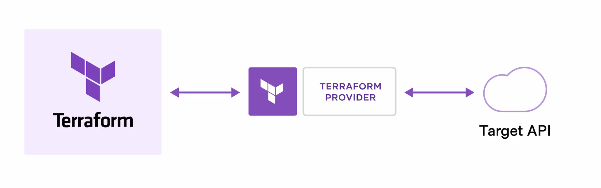
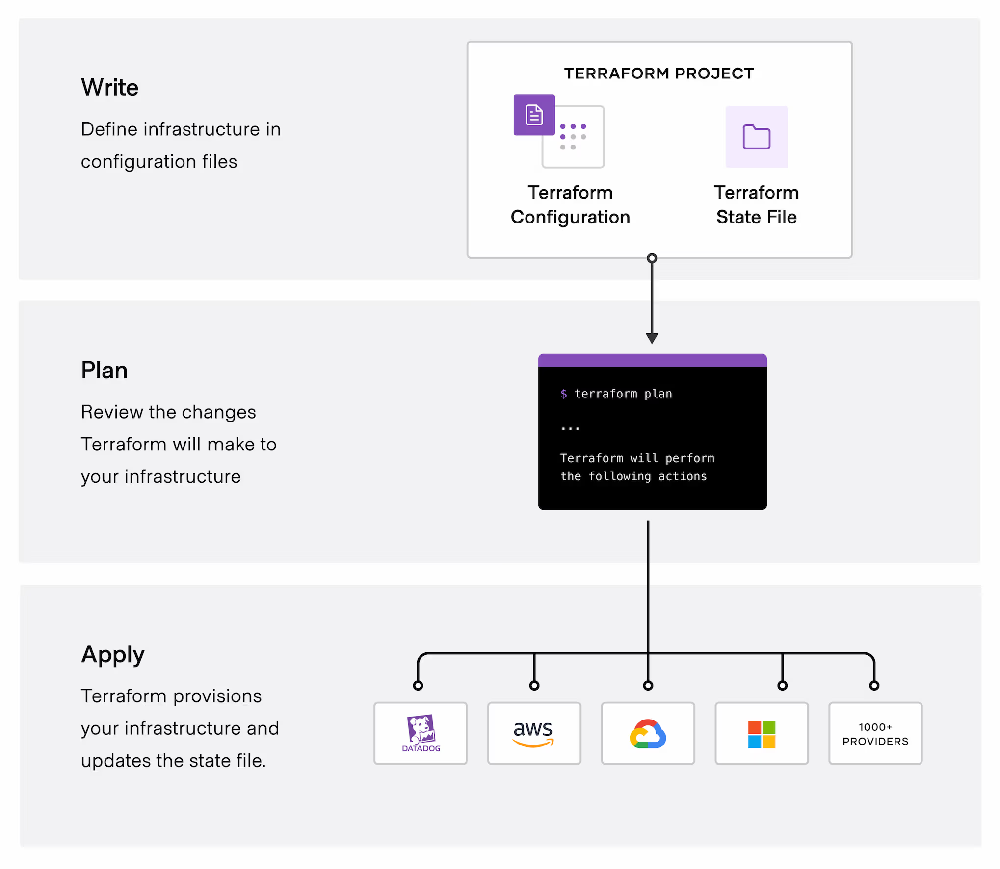

# Terraform

## Introduction
Terraform is an open-source tool for provisioning infrastructure using code. It allows users to define resources declaratively in configuration files and manage them consistently.
Terraform can manage low-level components like compute, storage, and networking resources, as well as high-level components like DNS entries and SaaS features.

## How does it work?
Terraform uses a declarative configuration language to define infrastructure resources. It uses a backend to store the configuration state, which is used to create and destroy resources.
Terraform can be used to provision infrastructure in multiple cloud providers, such as AWS, Azure, and Google Cloud.

The core Terraform workflow consists of the following steps:

1. **Write**: Define the infrastructure resources in a configuration file.
2. **Plan**: Initialize Terraform to download the required providers and plugins.
3. **Apply**: Apply the configuration to create the resources.
4. **Destroy**: Destroy the resources if needed.
 
 

## Why use Terraform?

- **Tracking**: Terraform tracks the state of the infrastructure resources, allowing users to track changes over time.
- **Reproducibility**: Terraform allows users to reproduce the infrastructure state at any point in time.
- **Automation**: Terraform can be used to automate infrastructure provisioning and management.
- **Collaboration**: Terraform can be used by multiple teams to manage infrastructure in a collaborative way.

## Practice
1. [Beginner Lab]()
2. [Intermediate Lab]()

## Sources
- [Terraform](https://developer.hashicorp.com/terraform)