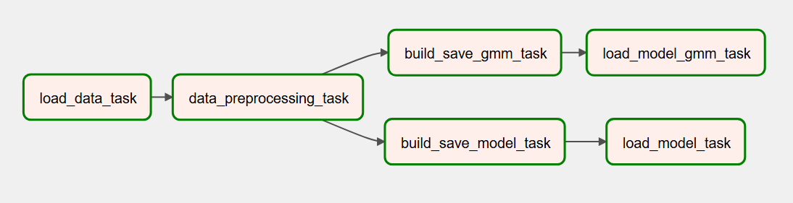
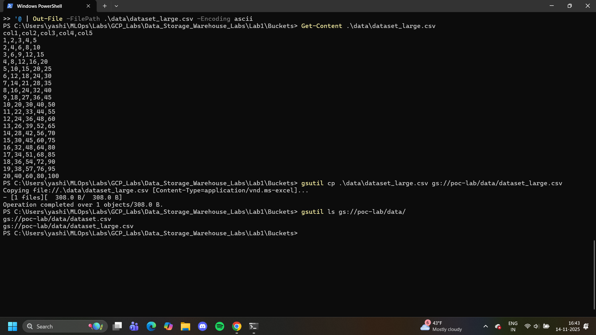
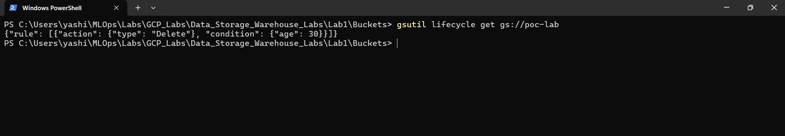

# MLOps Coursework Labs

## Lab 1 – (API Lab) API with FastAPI

In this lab, I built a **FastAPI application** to serve ML predictions on the Iris dataset.

### Changes Implemented

- **Added new models**:

  - Random Forest (`rf`)
  - Logistic Regression (`lr`)

- **Extended training script (`train.py`)**

  - Trains and saves three models: Decision Tree, Random Forest, Logistic Regression

- **Created separate prediction functions** in `predict.py`

  - `predict_dt`, `predict_rf`, `predict_lr`

- **New endpoints in `main.py`**

  - `POST /predict/dt` → Decision Tree
  - `POST /predict/rf` → Random Forest
  - `POST /predict/lr` → Logistic Regression

- **Improved response schema**
  - Predictions now return both the **class index** and the **species name** (`setosa`, `versicolor`, `virginica`).

---

## Lab 2 – (Airflow Lab) Orchestration with Airflow

In this lab, I built an **Apache Airflow DAG** to orchestrate a machine learning workflow for clustering.

### Changes Implemented

- **Extended pipeline beyond KMeans**

  - Original DAG used **KMeans clustering** only.
  - Added a new **Gaussian Mixture Model (GMM)** branch to compare results.

- **Improved outputs**

  - Both KMeans and GMM predictions are now **saved to CSV files** in the `working_data` directory:
    - `predictions_kmeans.csv`
    - `predictions_gmm.csv`
  - These files contain the original test data with predicted cluster labels.

- **Task design in Airflow**
  - Data load → Preprocessing → **Branch into KMeans & GMM**
  - Each branch trains, saves the model, runs predictions, and stores outputs.
  - Results can be inspected from both **XComs** and saved CSVs.

### DAG Graph

Here is a snapshot of the Airflow DAG pipeline:



---

## Lab 3 – (Docker Lab) Flask Deployment and Model Enhancement

In this lab, I extended the **Dockerized Flask application** from previous work to serve multiple models and improve observability.

### Changes Implemented

- **Added a `/health` endpoint**

  - Simple `GET /health` route returning `{"status": "ok"}` for container health checks.
  - Used to confirm the app is running successfully inside Docker.

- **Introduced a new model (K-Nearest Neighbors)**

  - `model_training.py` now trains and saves both:
    - Logistic Regression (`my_model.pkl`)
    - KNN Classifier (`knn_model.pkl`)
  - Both models share a common `StandardScaler` to ensure consistent preprocessing.

- **Added a new prediction endpoint**

  - `GET` / `POST /predict` → serves predictions using the Logistic Regression model.
  - `GET` / `POST /predict_knn` → serves predictions using the new KNN model.
  - Both endpoints can return JSON responses or render an HTML input form.

- **Updated Docker setup**

  - Multi-stage Dockerfile:
    - Stage 1 trains the models.
    - Stage 2 serves predictions through Flask.
  - Model artifacts (`.pkl` files and `scaler.pkl`) are copied from the training stage into the serving image.
  - CMD updated to run `main.py` automatically at container startup.

### 🐳 How to Build and Run (Lab 3)

**Build the image**

```bash
docker build -t app .
```

---

## Lab 4 – (Data Lab) LLM Data Pipeline

In this lab, I modified the Lab1 to a new notebook **lab1_modified**.

This version of the lab builds on the original LLM preprocessing pipeline and adds a few practical improvements to make it closer to real-world data preparation and training workflows.

- Text Cleaning: Removed extra whitespace and normalized formatting.

- Deduplication: Filtered out repeated lines to avoid model bias.

- Train/Validation Split: Enables proper evaluation instead of training on a single dataset.

- Token Length Diagnostics: Summarized raw token lengths before grouping to help select an appropriate block size.

- Documentation: Added meaningful comments and docstrings throughout the code for clarity.

- Training Loop: Ran a short training segment using GPT-2 to verify that the processed data can be used directly for model training.

- Perplexity Evaluation: Computed validation perplexity to measure model quality on unseen text.

---

## Lab 5 – (GCP Lab) Data Storage & Warehouse – GCS Buckets

In this lab, I worked with Google Cloud Storage (GCS) to manage datasets in a cloud environment and explore key storage features such as versioning and lifecycle rules.

Changes Implemented

- Created and configured a new GCS bucket

- Set up a dedicated bucket for lab work, connected it to the correct GCP project, and authenticated the local system to interact with GCS from the terminal.

- Added two datasets to the bucket

- A small sample dataset (dataset.csv)

- A larger dataset (dataset_large.csv) with additional rows and columns
  Both files were uploaded to a data/ directory within the bucket for organization.

Screenshot – Uploaded Datasets:


Enabled Object Versioning
Versioning was turned on for the bucket to maintain a complete history of changes to stored objects. This ensures older versions can be retrieved even after files are overwritten or updated.

Applied Lifecycle Management Policy
Added a lifecycle rule through a lifecycle.json configuration that automatically deletes objects older than 30 days. This helps manage storage costs and keeps the bucket clean over time.

Screenshot – Lifecycle Rule:


---

## Lab 6 – Terraform / GCP Lab

In this lab, we set up **Terraform on Windows**, configured the **Google Cloud provider**, and deployed resources on GCP using the instructions provided.

We authenticated using a service account key and exported:

```
GOOGLE_APPLICATION_CREDENTIALS="C:\Users\yashi\MLOps\Labs\Terraform_Labs\GCP\your-key-file.json"
```

After installation and initialization (`terraform init`), we successfully applied Terraform to create our resources.

### **Screenshots**

**Terraform Apply Output**


**Terraform Bucket Created in GCP**


---

## Changes Made in `main.tf`

We expanded the base configuration to include:

### 1. A Compute Engine VM

- Machine type: `f1-micro`
- OS image: Debian 11
- Added labels (`environment`, `owner`)
- Added network tags for firewall use
- Added a startup script to write a file on boot

### 2. A Firewall Rule

- Allows SSH (`tcp:22`)
- Applies to VMs with tag `"ssh-allowed"`
- Network: default

### 3. A Storage Bucket

- Unique bucket name
- `force_destroy = true`
- Added labels

### 4. Terraform Outputs

- Public IP of the VM
- Bucket name

These changes show how Terraform manages multiple GCP resources and relationships between them.

### Updated `main.tf` Output Screenshot


---
